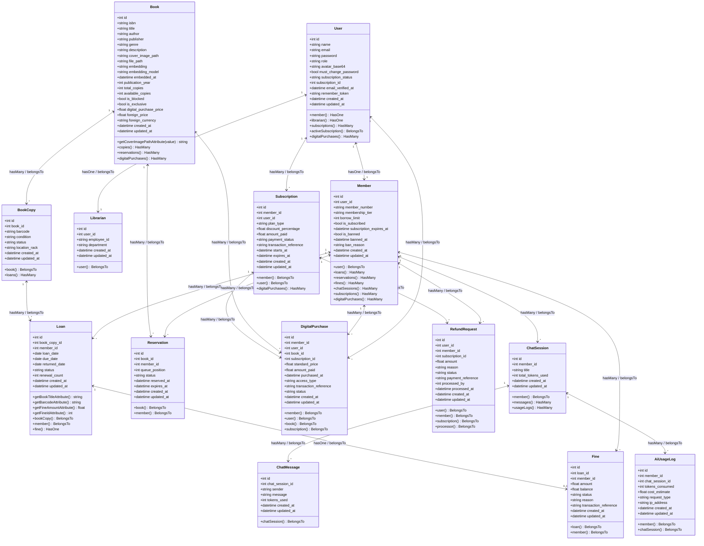

# Class Diagrams Specification

This document details the object-oriented structure of the **Smart Library Management System** across Models, Controllers, and Services with all methods and attributes.

---

## 1. Eloquent Models Architecture

---

## 2. REST Controllers Layer

```mermaid
classDiagram
    class AuthController {
        -AuthSessionServiceInterface authService
        +register(Request request) JsonResponse
        +registerMembershipStk(Request request) JsonResponse
        +login(Request request) JsonResponse
        +me(Request request) JsonResponse
        +updateProfile(Request request) JsonResponse
        +refresh(Request request) JsonResponse
        +logout(Request request) JsonResponse
    }

    class BookInventoryController {
        -CatalogRetrievalServiceInterface catalogService
        -CurrencyConverterServiceInterface converter
        +index(Request request) JsonResponse
        +show(Book book) JsonResponse
        +store(Request request) JsonResponse
        +update(Request request, Book book) JsonResponse
        +destroy(Book book) JsonResponse
    }

    class CatalogSearchController {
        -CatalogSearchEngineInterface searchEngine
        +search(Request request) JsonResponse
    }

    class BookRecommendationController {
        -BookRecommendationServiceInterface recService
        +similar(Book book) JsonResponse
        +forMember(Request request) JsonResponse
    }

    class LoanController {
        -BookAvailabilityServiceInterface availService
        -BorrowLimitServiceInterface limitService
        -NotificationDispatcherServiceInterface notifyService
        +index(Request request) JsonResponse
        +checkout(Request request) JsonResponse
        +returnBook(Loan loan) JsonResponse
    }

    class FineController {
        -DarajaPaymentServiceInterface darajaService
        -NotificationDispatcherServiceInterface notifyService
        +index(Request request) JsonResponse
        +payWithDaraja(Fine fine, Request request) JsonResponse
        +darajaCallback(Request request) JsonResponse
        +waive(Fine fine) JsonResponse
    }

    class ReservationController {
        -QueueReservationServiceInterface queueService
        +index(Request request) JsonResponse
        +store(Request request) JsonResponse
        +destroy(Reservation reservation) JsonResponse
    }

    class DigitalRentalController {
        -DigitalRentalServiceInterface digitalService
        -DarajaPaymentServiceInterface darajaService
        +myLibrary(Request request) JsonResponse
        +checkoutCart(Request request) JsonResponse
        +purchase(int id, Request request) JsonResponse
        +read(int id, Request request) JsonResponse
    }

    class SubscriptionController {
        -DarajaPaymentServiceInterface darajaService
        -RefundManagementServiceInterface refundService
        +checkout(Request request) JsonResponse
        +status(Request request) JsonResponse
        +cancel(Request request) JsonResponse
        +requestRefund(Request request) JsonResponse
        +refundStatus(Request request) JsonResponse
    }

    class MembershipTierController {
        +index() JsonResponse
        +update(Request request) JsonResponse
        -getDefaultTiers() array
        -getSettingsFilePath() string
    }

    class AiChatbotController {
        -AiLibrarianManagerService aiManager
        +chat(Request request) JsonResponse
        +clearChat(Request request) JsonResponse
    }

    class AiSettingsController {
        -AiLibrarianManagerService aiManager
        +index() JsonResponse
        +update(Request request) JsonResponse
        +testKey(Request request) JsonResponse
        +fetchModels(Request request) JsonResponse
    }

    class LibrarianDashboardController {
        -OpenLibraryServiceInterface openLibrary
        +metrics() JsonResponse
        +members(Request request) JsonResponse
        +configureBorrowLimit(Member member, Request request) JsonResponse
        +toggleBookRestriction(Book book) JsonResponse
        +bookCopies(Request request) JsonResponse
        +storeBookCopy(Request request) JsonResponse
        +updateBookCopy(BookCopy copy, Request request) JsonResponse
        +deleteBookCopy(BookCopy copy) JsonResponse
        +activeLoans(Request request) JsonResponse
        +subscriptions(Request request) JsonResponse
        +storeSubscription(Request request) JsonResponse
        +updateSubscription(Subscription sub, Request request) JsonResponse
        +deleteSubscription(Subscription sub) JsonResponse
        +reimbursements() JsonResponse
        +reviewReimbursement(int id, Request request) JsonResponse
        +getRefundRequests() JsonResponse
        +approveRefund(int id) JsonResponse
        +rejectRefund(int id, Request request) JsonResponse
        +searchOpenLibrary(Request request) JsonResponse
        +importOpenLibrary(Request request) JsonResponse
        +reservations(Request request) JsonResponse
        +approveReservation(Reservation res) JsonResponse
        +denyReservation(Reservation res) JsonResponse
    }

    class AdminAnalyticsController {
        +analytics() JsonResponse
        +apiLogs(Request request) JsonResponse
        +banMember(Member member, Request request) JsonResponse
        +storeLibrarian(Request request) JsonResponse
    }

    class AdminCrudController {
        +indexTables() JsonResponse
        +getTableData(string table) JsonResponse
        +storeRecord(string table, Request request) JsonResponse
        +updateRecord(string table, int id, Request request) JsonResponse
        +destroyRecord(string table, int id) JsonResponse
    }
```

---

## 3. Services & Contracts Layer

```mermaid
classDiagram
    class AuthSessionServiceInterface {
        <<interface>>
        +createSessionToken(User user, bool remember) string
        +validateSessionToken(string token) ?User
        +invalidateSessionToken(string token) bool
        +getAuthenticatedUser(string token) ?User
    }

    class AuthSessionService {
        -string secret
        +generateToken(User user, bool remember) string
        +generateAccessToken(User user) string
        +generateRefreshToken(User user) string
        +buildJwt(User user, string type, int ttl) string
        +validateToken(string token) ?array
        +blacklistToken(string token) void
    }

    class DigitalRentalServiceInterface {
        <<interface>>
        +purchaseBook(Member member, Book book, string ref) DigitalPurchase
        +hasDigitalAccess(Member member, Book book) bool
        +getMemberLibrary(Member member) Collection
    }

    class DigitalRentalService {
        +purchaseBook(Member member, Book book, string ref) DigitalPurchase
        +hasDigitalAccess(Member member, Book book) bool
        +getMemberLibrary(Member member) Collection
        +canReadBook(Member member, Book book) bool
        +getPurchasedContent(Member member, Book book) string
    }

    class DarajaPaymentServiceInterface {
        <<interface>>
        +initiateStkPush(string phone, float amount, string ref) array
        +processCallback(array payload) array
        +queryStatus(string checkoutRequestId) array
    }

    class DarajaPaymentService {
        -string consumerKey
        -string consumerSecret
        -string passkey
        -string shortcode
        -string env
        +generateAccessToken() string
        +initiateStkPush(string phone, float amount, string ref) array
        +processCallback(array payload) array
        +queryStatus(string checkoutRequestId) array
    }

    class OpenLibraryServiceInterface {
        <<interface>>
        +search(string query, int page) array
        +importToCatalog(array bookData) Book
    }

    class OpenLibraryService {
        -string userAgent
        -int throttleMs
        +search(string query, int page) array
        +fetchSubject(string subject, int limit) array
        +importToCatalog(array bookData) Book
        +buildBookCopies(Book book, int count) void
    }

    class AiLibrarianManagerService {
        -string settingsFilePath
        +getDefaultSystemPrompt() string
        +getDefaultSettings() array
        +getSettings() array
        +saveSettings(array settings) void
        +testKey(string provider, string key) array
        +fetchAvailableModels(string provider, ?string key) array
        +chat(string prompt, ?ChatSession session, ?Member member) array
        -callGemini(string prompt, array config, string systemPrompt) array
        -callOpenAi(string prompt, array config, string systemPrompt) array
        -callAnthropic(string prompt, array config, string systemPrompt) array
        -callOfflineEngine(string prompt, ?Member member) array
        -buildCatalogContext() string
    }

    class TokenBucketRateLimiter {
        +consume(int memberId, int tokens) bool
        +getRemainingTokens(int memberId) int
        +reset(int memberId) void
    }

    class BookRecommendationService {
        +getSimilarBooks(Book book, int limit) Collection
        +getRecommendationsForMember(Member member, int limit) Collection
        -buildTfIdfMatrix(Collection books) array
        -computeCosineSimilarity(array vec1, array vec2) float
    }

    class CurrencyConverterService {
        -float fallbackRate
        +convertUsdToKes(float usdAmount) float
        +getExchangeRates() array
    }

    class BorrowLimitService {
        +canBorrowMore(Member member) bool
        +getActiveLoansCount(Member member) int
        +getEffectiveLimit(Member member) int
    }

    class QueueReservationService {
        +placeHold(Book book, Member member) Reservation
        +cancelReservation(Reservation reservation) bool
        +getNextInQueue(Book book) ?Reservation
        +fulfillReservation(Reservation reservation) Loan
    }

    AuthSessionServiceInterface <|.. AuthSessionService
    DigitalRentalServiceInterface <|.. DigitalRentalService
    DarajaPaymentServiceInterface <|.. DarajaPaymentService
    OpenLibraryServiceInterface <|.. OpenLibraryService
```

