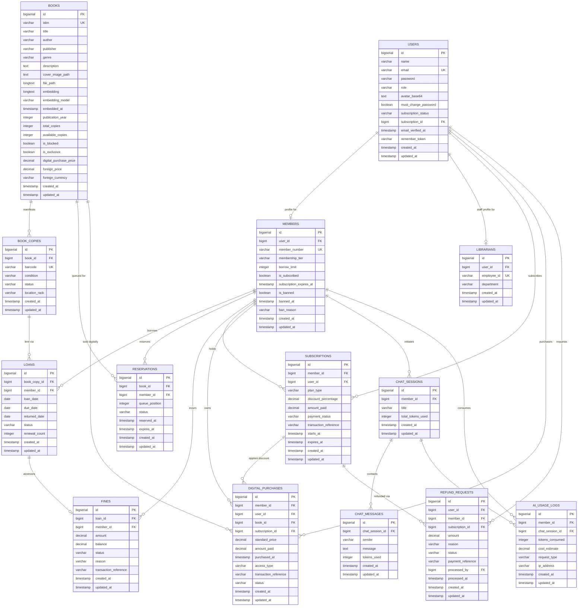

# Relational Database Schema & Data Dictionary

This document details the complete database schema for the **Smart Library Management System** running on PostgreSQL (Neon Cloud / Local).

---

## 1. Entity-Relationship (ER) Diagram

---

## 2. Table Dictionaries

### 2.1. `users` Table
| Column | Type | Nullable | Default | Description |
| :--- | :--- | :--- | :--- | :--- |
| `id` | `BIGSERIAL` | No | Auto | Primary key |
| `name` | `VARCHAR(255)` | No | — | Full name of user |
| `email` | `VARCHAR(255)` | No | — | Unique login email |
| `email_verified_at` | `TIMESTAMP` | Yes | `NULL` | Verification timestamp |
| `password` | `VARCHAR(255)` | No | — | Bcrypt / Argon2 password hash |
| `role` | `VARCHAR(255)` | No | `'member'` | Role gate: `member`, `librarian`, `admin` |
| `avatar_base64` | `TEXT` | Yes | `NULL` | Base64 encoded patron avatar image |
| `must_change_password` | `BOOLEAN` | No | `FALSE` | Enforced first-login password reset |
| `subscription_status` | `VARCHAR(255)`| No | `'none'` | `'none'`, `'active'`, `'expired'` |
| `subscription_id` | `BIGINT` | Yes | `NULL` | FK to `subscriptions.id` (current pass) |
| `remember_token` | `VARCHAR(100)` | Yes | `NULL` | Session cookie token |
| `created_at` | `TIMESTAMP` | Yes | `NULL` | Record creation timestamp |
| `updated_at` | `TIMESTAMP` | Yes | `NULL` | Record last updated timestamp |

### 2.2. `members` Table
| Column | Type | Nullable | Default | Description |
| :--- | :--- | :--- | :--- | :--- |
| `id` | `BIGSERIAL` | No | Auto | Primary key |
| `user_id` | `BIGINT` | No | — | FK &rarr; `users.id` (ON DELETE CASCADE) |
| `member_number` | `VARCHAR(255)` | No | — | Unique identifier (e.g. `MEM-2026`) |
| `membership_tier` | `VARCHAR(255)` | No | `'standard'` | `student`, `standard`, `scholar`, `faculty`, `general` |
| `borrow_limit` | `INTEGER` | No | `3` | Maximum concurrent physical loans allowed |
| `is_subscribed` | `BOOLEAN` | No | `FALSE` | Active perk pass discount status |
| `subscription_expires_at` | `TIMESTAMP`| Yes | `NULL` | Perk pass expiry date |
| `is_banned` | `BOOLEAN` | No | `FALSE` | True if account access is restricted |
| `banned_at` | `TIMESTAMP` | Yes | `NULL` | Time ban was imposed |
| `ban_reason` | `VARCHAR(255)` | Yes | `NULL` | Administrative reason for ban |
| `created_at` | `TIMESTAMP` | Yes | `NULL` | Record created timestamp |
| `updated_at` | `TIMESTAMP` | Yes | `NULL` | Record updated timestamp |

### 2.3. `librarians` Table
| Column | Type | Nullable | Default | Description |
| :--- | :--- | :--- | :--- | :--- |
| `id` | `BIGSERIAL` | No | Auto | Primary key |
| `user_id` | `BIGINT` | No | — | FK &rarr; `users.id` (ON DELETE CASCADE) |
| `employee_id` | `VARCHAR(255)` | No | — | Unique staff ID (e.g. `LIB-1002`) |
| `department` | `VARCHAR(255)` | Yes | `NULL` | Assigned library department |
| `created_at` | `TIMESTAMP` | Yes | `NULL` | Record created timestamp |
| `updated_at` | `TIMESTAMP` | Yes | `NULL` | Record updated timestamp |

### 2.4. `books` Table
| Column | Type | Nullable | Default | Description |
| :--- | :--- | :--- | :--- | :--- |
| `id` | `BIGSERIAL` | No | Auto | Primary key |
| `isbn` | `VARCHAR(255)` | No | — | Unique standard book number |
| `title` | `VARCHAR(255)` | No | — | Official title |
| `author` | `VARCHAR(255)` | No | — | Author / contributors |
| `publisher` | `VARCHAR(255)` | Yes | `NULL` | Publishing house |
| `genre` | `VARCHAR(255)` | No | — | Literary category |
| `description` | `TEXT` | Yes | `NULL` | Book overview & synopsis |
| `cover_image_path`| `TEXT` | Yes | `NULL` | URL or asset path to book cover image |
| `file_path` | `LONGTEXT` | Yes | `NULL` | JSON multi-chapter structured content / PDF |
| `embedding` | `LONGTEXT` | Yes | `NULL` | JSON vector for semantic similarity |
| `embedding_model`| `VARCHAR(255)` | Yes | `NULL` | Model used for embedding generation |
| `embedded_at` | `TIMESTAMP` | Yes | `NULL` | Timestamp of last vector indexing |
| `publication_year`| `INTEGER` | Yes | `NULL` | Year of publication |
| `total_copies` | `INTEGER` | No | `1` | Total inventory copies owned |
| `available_copies`| `INTEGER` | No | `1` | Inventory copies currently on shelf |
| `is_blocked` | `BOOLEAN` | No | `FALSE` | If true, borrowing is restricted |
| `is_exclusive` | `BOOLEAN` | No | `FALSE` | VIP/Subscriber exclusive access |
| `digital_purchase_price` | `DECIMAL(8,2)` | No | `50.00` | Authoritative digital price in KES |
| `foreign_price` | `DECIMAL(10,2)`| Yes | `NULL` | Retail price in foreign currency |
| `foreign_currency` | `VARCHAR(3)` | Yes | `NULL` | Currency code (e.g. `USD`, `EUR`) |
| `created_at` | `TIMESTAMP` | Yes | `NULL` | Record created timestamp |
| `updated_at` | `TIMESTAMP` | Yes | `NULL` | Record updated timestamp |

### 2.5. `book_copies` Table
| Column | Type | Nullable | Default | Description |
| :--- | :--- | :--- | :--- | :--- |
| `id` | `BIGSERIAL` | No | Auto | Primary key |
| `book_id` | `BIGINT` | No | — | FK &rarr; `books.id` (ON DELETE CASCADE) |
| `barcode` | `VARCHAR(255)` | No | — | Unique barcode (e.g. `BC-9780132350884-001`) |
| `condition` | `VARCHAR(255)` | No | `'good'` | `'good'`, `'damaged'`, `'lost'` |
| `status` | `VARCHAR(255)` | No | `'available'` | `'available'`, `'checked_out'`, `'reserved'`, `'maintenance'` |
| `location_rack` | `VARCHAR(255)` | Yes | `NULL` | Physical shelf location (e.g. `Rack-3`) |
| `created_at` | `TIMESTAMP` | Yes | `NULL` | Record created timestamp |
| `updated_at` | `TIMESTAMP` | Yes | `NULL` | Record updated timestamp |

### 2.6. `loans` Table
| Column | Type | Nullable | Default | Description |
| :--- | :--- | :--- | :--- | :--- |
| `id` | `BIGSERIAL` | No | Auto | Primary key |
| `book_copy_id` | `BIGINT` | No | — | FK &rarr; `book_copies.id` (ON DELETE CASCADE) |
| `member_id` | `BIGINT` | No | — | FK &rarr; `members.id` (ON DELETE CASCADE) |
| `loan_date` | `DATE` | No | — | Date book was checked out |
| `due_date` | `DATE` | No | — | Date book must be returned |
| `returned_date` | `DATE` | Yes | `NULL` | Date book was checked back in |
| `status` | `VARCHAR(255)` | No | `'active'` | `'active'`, `'returned'`, `'overdue'` |
| `renewal_count` | `INTEGER` | No | `0` | Number of times loan was extended |
| `created_at` | `TIMESTAMP` | Yes | `NULL` | Record created timestamp |
| `updated_at` | `TIMESTAMP` | Yes | `NULL` | Record updated timestamp |

### 2.7. `reservations` Table
| Column | Type | Nullable | Default | Description |
| :--- | :--- | :--- | :--- | :--- |
| `id` | `BIGSERIAL` | No | Auto | Primary key |
| `book_id` | `BIGINT` | No | — | FK &rarr; `books.id` (ON DELETE CASCADE) |
| `member_id` | `BIGINT` | No | — | FK &rarr; `members.id` (ON DELETE CASCADE) |
| `queue_position`| `INTEGER` | No | `1` | FIFO queue position |
| `status` | `VARCHAR(255)` | No | `'pending'` | `'pending'`, `'ready_for_pickup'`, `'fulfilled'`, `'expired'`, `'cancelled'` |
| `reserved_at` | `TIMESTAMP` | No | `CURRENT_TIMESTAMP` | Time hold was placed |
| `expires_at` | `TIMESTAMP` | Yes | `NULL` | 48h pickup window expiration |
| `created_at` | `TIMESTAMP` | Yes | `NULL` | Record created timestamp |
| `updated_at` | `TIMESTAMP` | Yes | `NULL` | Record updated timestamp |

### 2.8. `fines` Table
| Column | Type | Nullable | Default | Description |
| :--- | :--- | :--- | :--- | :--- |
| `id` | `BIGSERIAL` | No | Auto | Primary key |
| `loan_id` | `BIGINT` | No | — | FK &rarr; `loans.id` (ON DELETE CASCADE) |
| `member_id` | `BIGINT` | No | — | FK &rarr; `members.id` (ON DELETE CASCADE) |
| `amount` | `DECIMAL(10,2)`| No | — | Total fine assessed in KES |
| `balance` | `DECIMAL(10,2)`| No | — | Remaining unpaid balance |
| `status` | `VARCHAR(255)` | No | `'unpaid'` | `'unpaid'`, `'paid'`, `'waived'`, `'partial'` |
| `reason` | `VARCHAR(255)` | No | `'overdue'` | `'overdue'`, `'damage'`, `'loss'` |
| `transaction_reference` | `VARCHAR(255)`| Yes | `NULL` | Daraja M-Pesa receipt code |
| `created_at` | `TIMESTAMP` | Yes | `NULL` | Record created timestamp |
| `updated_at` | `TIMESTAMP` | Yes | `NULL` | Record updated timestamp |

### 2.9. `subscriptions` Table
| Column | Type | Nullable | Default | Description |
| :--- | :--- | :--- | :--- | :--- |
| `id` | `BIGSERIAL` | No | Auto | Primary key |
| `member_id` | `BIGINT` | No | — | FK &rarr; `members.id` (ON DELETE CASCADE) |
| `user_id` | `BIGINT` | No | — | FK &rarr; `users.id` (ON DELETE CASCADE) |
| `plan_type` | `VARCHAR(255)` | No | `'pro_perks_monthly'` | Tier plan code (e.g. `scholar`, `student`) |
| `discount_percentage` | `DECIMAL(5,2)`| No | `20.00` | Percentage discount on digital purchases |
| `amount_paid` | `DECIMAL(10,2)`| No | `500.00` | Fee paid in KES |
| `payment_status`| `VARCHAR(255)` | No | `'paid'` | `'pending'`, `'paid'`, `'failed'` |
| `transaction_reference` | `VARCHAR(255)`| Yes | `NULL` | Daraja STK checkout reference |
| `starts_at` | `TIMESTAMP` | No | `CURRENT_TIMESTAMP` | Subscription start timestamp |
| `expires_at` | `TIMESTAMP` | Yes | `NULL` | Subscription expiry timestamp |
| `created_at` | `TIMESTAMP` | Yes | `NULL` | Record created timestamp |
| `updated_at` | `TIMESTAMP` | Yes | `NULL` | Record updated timestamp |

### 2.10. `digital_purchases` Table
| Column | Type | Nullable | Default | Description |
| :--- | :--- | :--- | :--- | :--- |
| `id` | `BIGSERIAL` | No | Auto | Primary key |
| `member_id` | `BIGINT` | No | — | FK &rarr; `members.id` (ON DELETE CASCADE) |
| `user_id` | `BIGINT` | No | — | FK &rarr; `users.id` (ON DELETE CASCADE) |
| `book_id` | `BIGINT` | No | — | FK &rarr; `books.id` (ON DELETE CASCADE) |
| `subscription_id`| `BIGINT` | Yes | `NULL` | FK &rarr; `subscriptions.id` (discount applied) |
| `standard_price`| `DECIMAL(8,2)` | No | — | Standard retail catalog price |
| `amount_paid` | `DECIMAL(8,2)` | No | — | Final price paid after member perks |
| `purchased_at` | `TIMESTAMP` | No | `CURRENT_TIMESTAMP` | Purchase completion timestamp |
| `access_type` | `VARCHAR(255)` | No | `'lifetime'` | Indefinite lifetime reading license |
| `transaction_reference` | `VARCHAR(255)`| Yes | `NULL` | Daraja payment reference |
| `status` | `VARCHAR(255)` | No | `'active'` | `'active'`, `'refunded'` |
| `created_at` | `TIMESTAMP` | Yes | `NULL` | Record created timestamp |
| `updated_at` | `TIMESTAMP` | Yes | `NULL` | Record updated timestamp |

### 2.11. `refund_requests` Table
| Column | Type | Nullable | Default | Description |
| :--- | :--- | :--- | :--- | :--- |
| `id` | `BIGSERIAL` | No | Auto | Primary key |
| `user_id` | `BIGINT` | No | — | FK &rarr; `users.id` (ON DELETE CASCADE) |
| `member_id` | `BIGINT` | No | — | FK &rarr; `members.id` (ON DELETE CASCADE) |
| `subscription_id`| `BIGINT` | Yes | `NULL` | FK &rarr; `subscriptions.id` |
| `amount` | `DECIMAL(10,2)`| No | — | Requested refund amount |
| `reason` | `VARCHAR(255)` | No | — | Reason provided by patron |
| `status` | `VARCHAR(255)` | No | `'pending'` | `'pending'`, `'approved'`, `'rejected'` |
| `payment_reference`| `VARCHAR(255)`| Yes | `NULL` | Original transaction reference |
| `processed_by` | `BIGINT` | Yes | `NULL` | FK &rarr; `users.id` (Staff who reviewed) |
| `processed_at` | `TIMESTAMP` | Yes | `NULL` | Timestamp of staff review |
| `created_at` | `TIMESTAMP` | Yes | `NULL` | Record created timestamp |
| `updated_at` | `TIMESTAMP` | Yes | `NULL` | Record updated timestamp |

### 2.12. `chat_sessions`, `chat_messages`, `ai_usage_logs` Tables
| Table | Key Columns | Description |
| :--- | :--- | :--- |
| **`chat_sessions`** | `id`, `member_id` (FK), `title`, `total_tokens_used`, `timestamps` | Chat container per patron session. |
| **`chat_messages`** | `id`, `chat_session_id` (FK), `sender` (`user`/`ai`), `message`, `tokens_used`, `timestamps` | Conversation turn messages. |
| **`ai_usage_logs`** | `id`, `member_id` (FK), `chat_session_id` (FK), `tokens_consumed`, `cost_estimate`, `request_type`, `ip_address`, `timestamps` | Cost and token consumption ledger. |

