# MaktabaBora - Visual Diagrams Gallery (Horizontal A4)

This directory contains standalone, high-resolution PNG image exports of all architectural and UML diagrams for the **MaktabaBora Library Management System**, formatted in **Horizontal A4 (297 x 210 mm)** landscape layout with complete title headers and metadata banners.

---

## 1. Use Case Diagram
### Actor Interactions & System Boundary
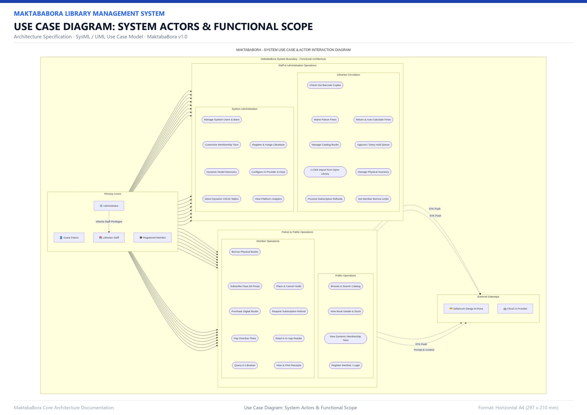

---

## 2. Sequence Diagrams

### Sequence 1: Authentication & JWT Token Lifecycle
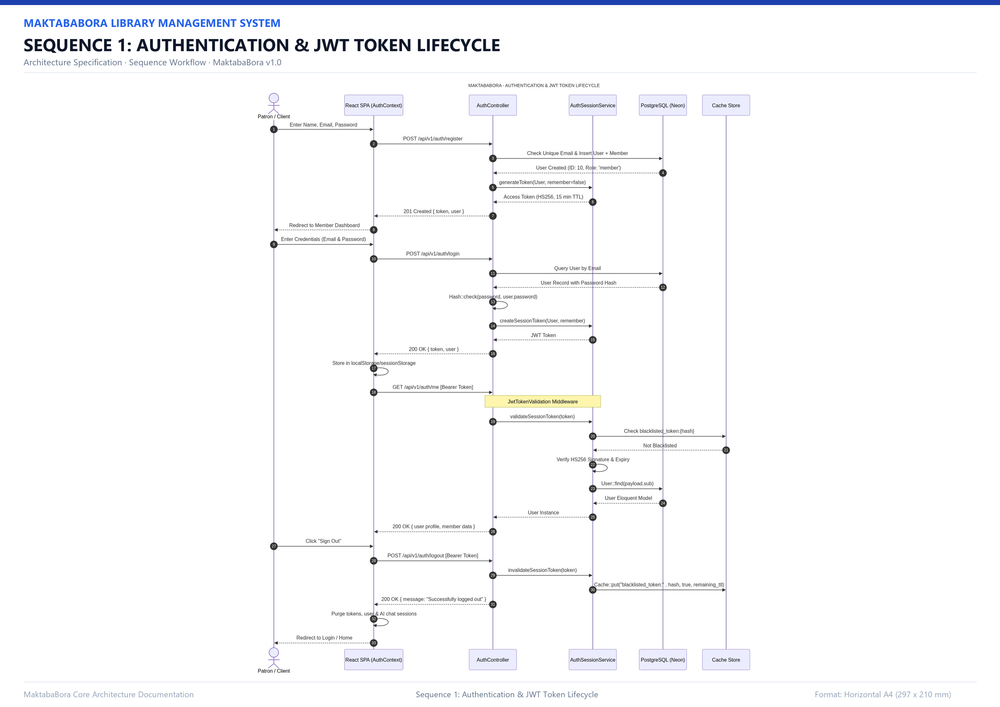

---

### Sequence 2: Physical Book Circulation (Checkout, Returns & Overdue Fines)
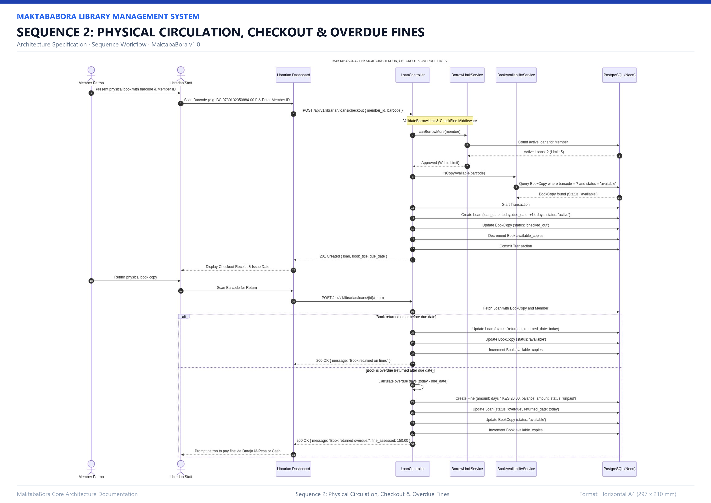

---

### Sequence 3: Hold Reservation Queue & Staff Fulfillment
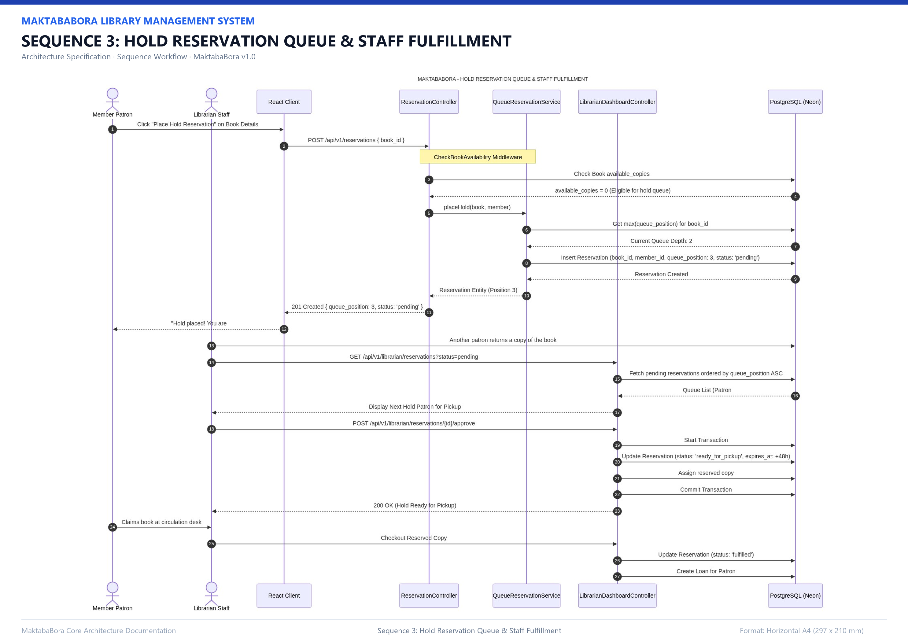

---

### Sequence 4: Digital Book Purchase via M-Pesa STK Push & Lifetime Reader
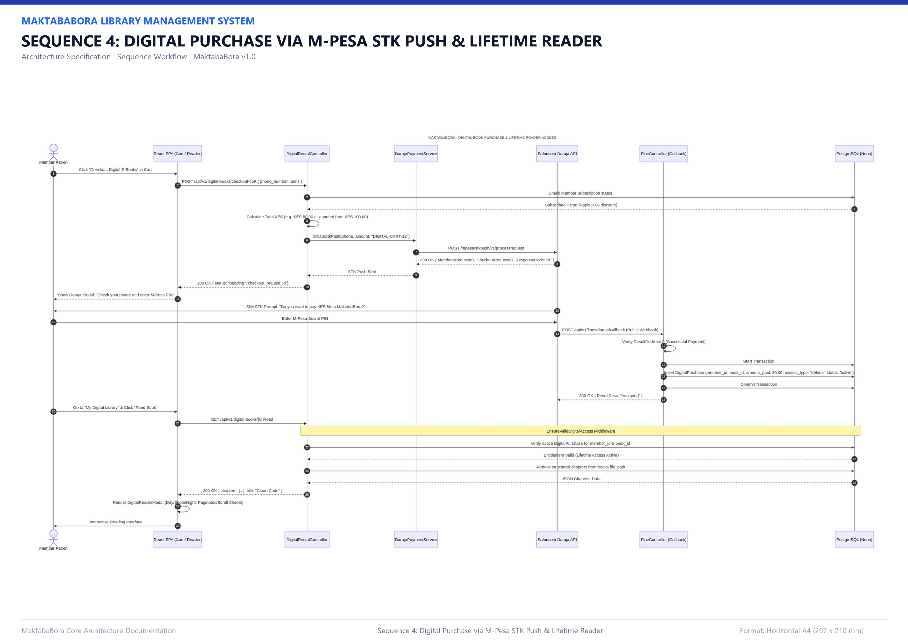

---

### Sequence 5: Membership Perk Pass Subscription & Refund Flow
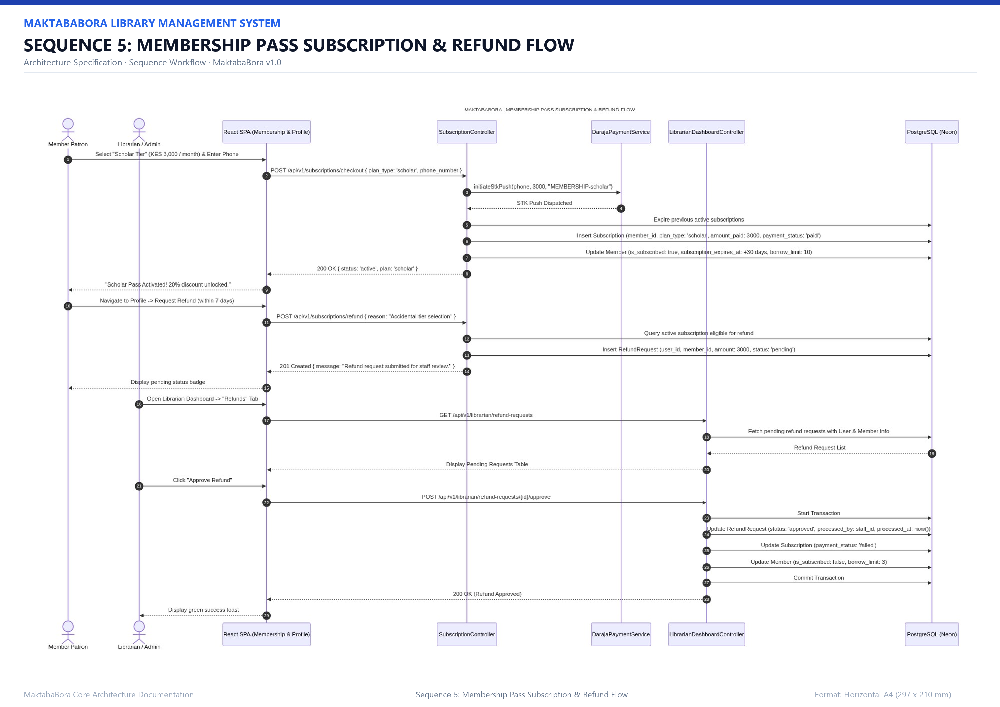

---

### Sequence 6: Smart AI Librarian Assistant (Rate-Limited RAG Flow)
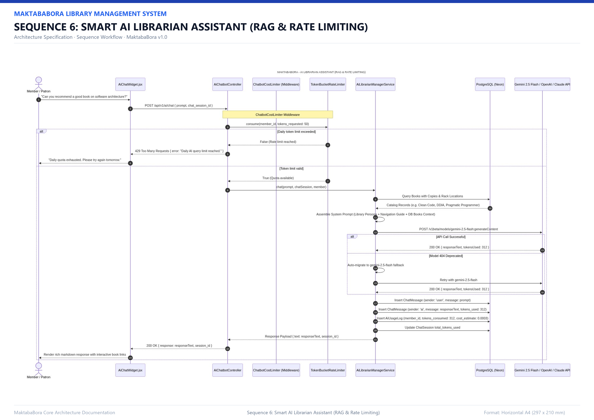

---

## 3. Class Diagrams

### Class Diagram 1: Eloquent Models Architecture (14 Models)
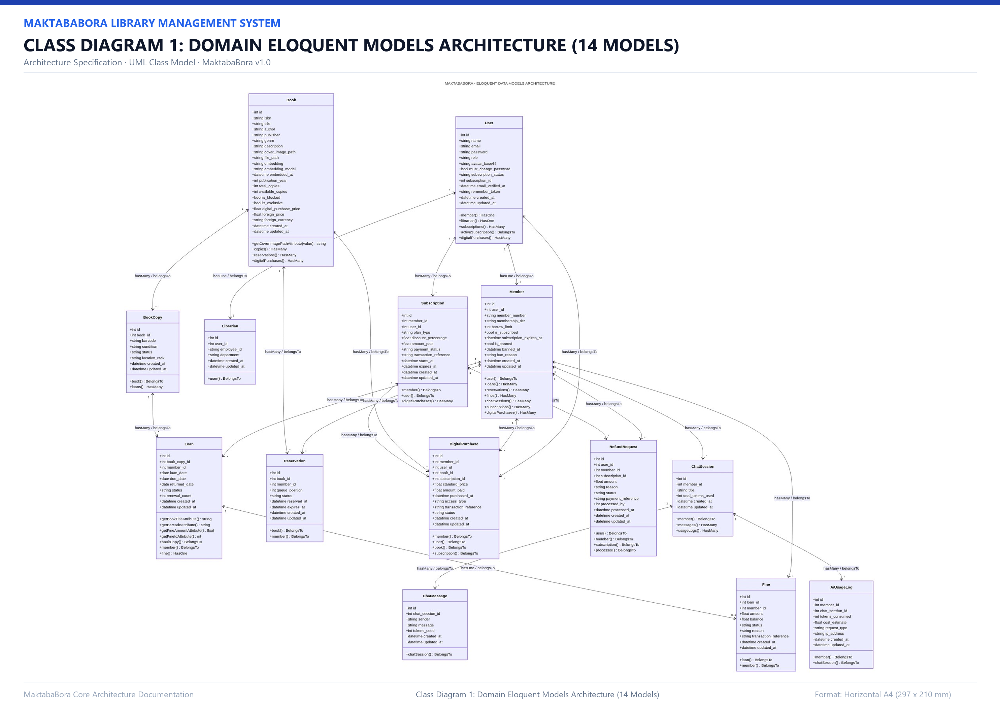

---

### Class Diagram 2: REST Controllers Layer (15 Controllers in 4 Subsystems)
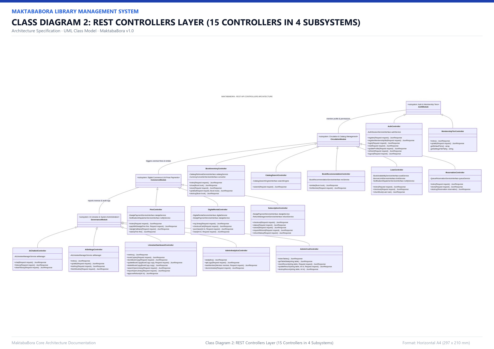

---

### Class Diagram 3: Domain Services & Contracts Layer
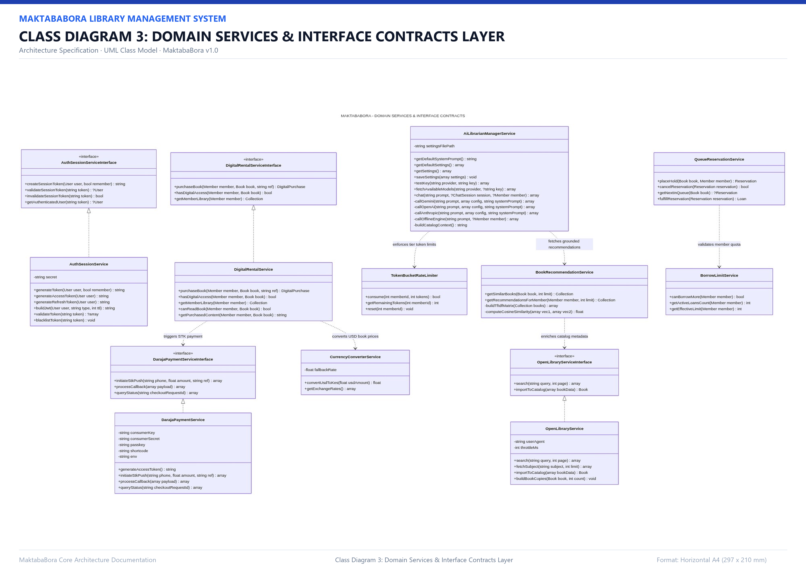

---

## 4. Relational Database Schema

### Database Schema: Entity-Relationship (ER) Diagram
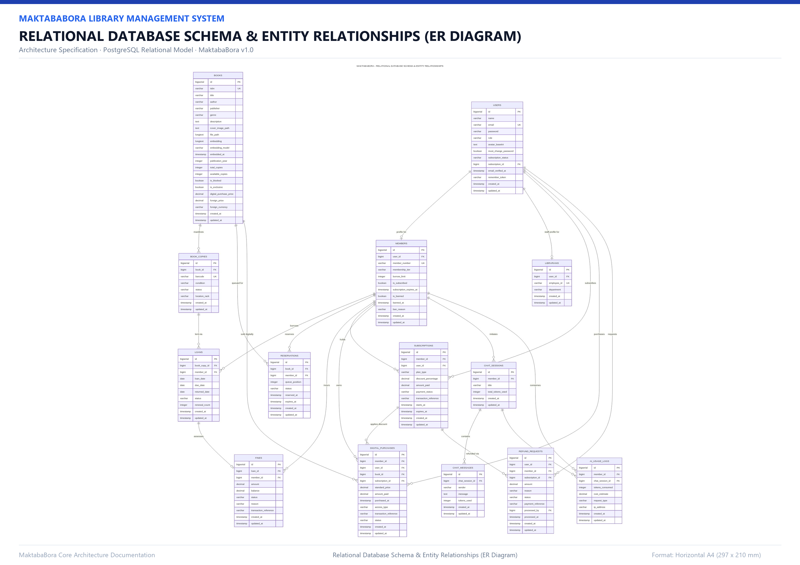
