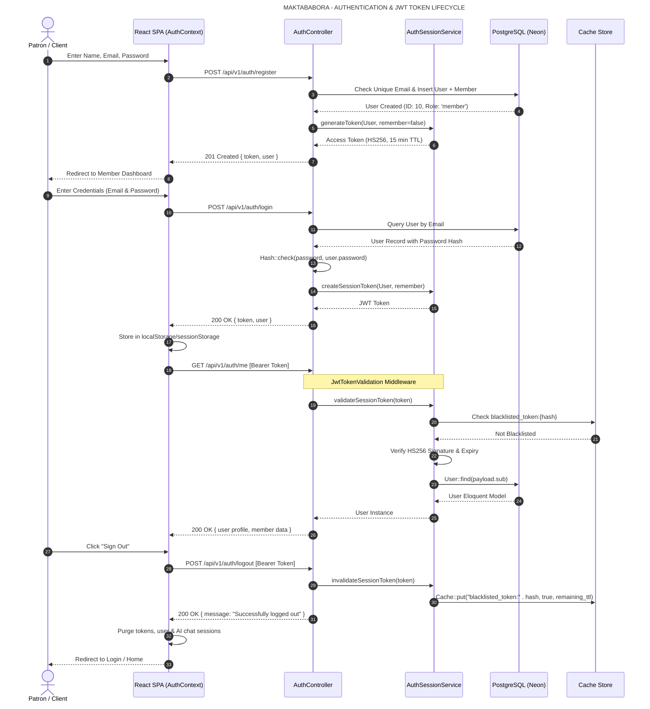
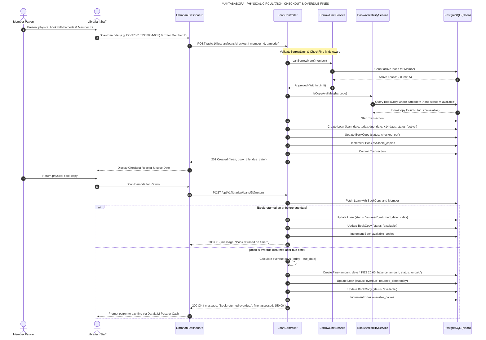
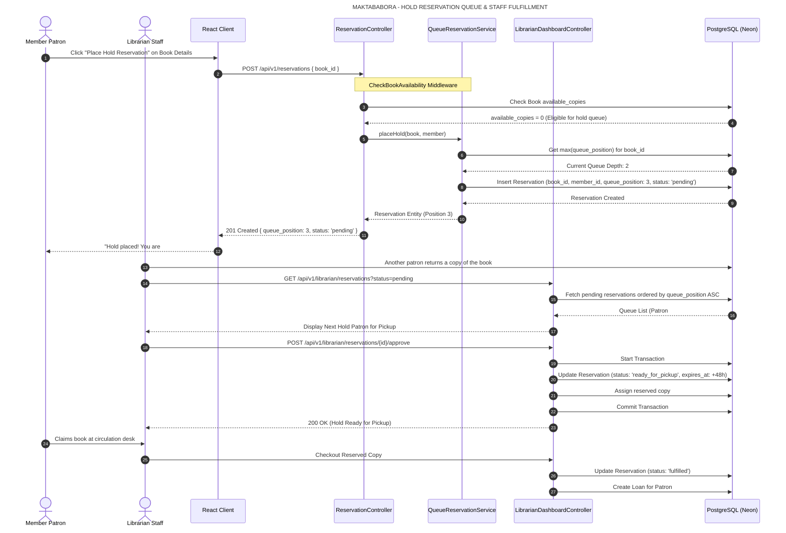
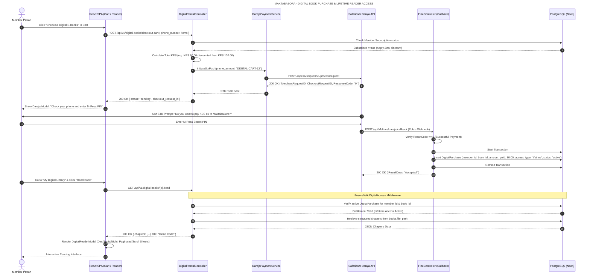
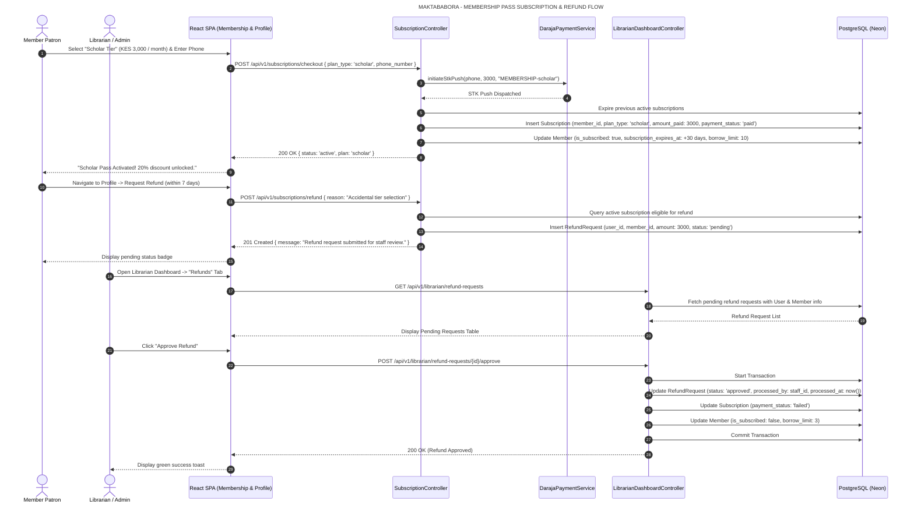
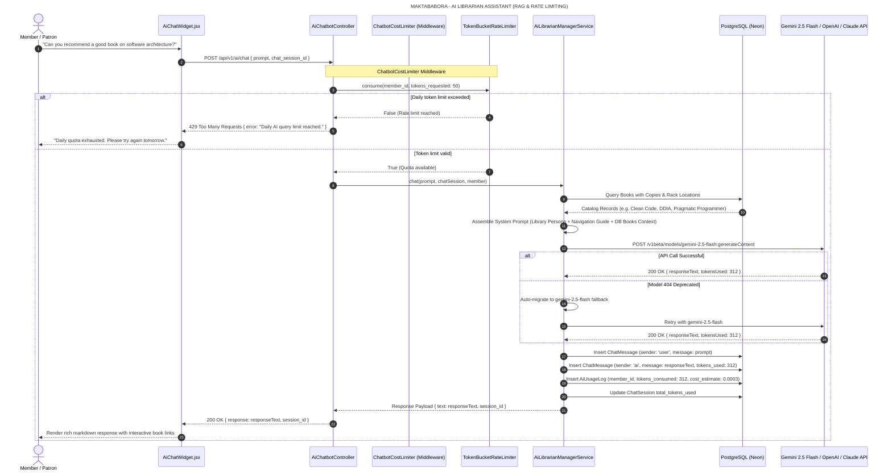

# MaktabaBora - Sequence Diagrams Specification

This document details the 6 core operational workflows of the **MaktabaBora Library Management System** using UML sequence diagrams formatted for **Horizontal A4** presentation.

---

## 1. Authentication & JWT Token Lifecycle

---

## 2. Physical Book Circulation: Checkout, Return & Overdue Fines

---

## 3. Hold Reservation Queue Lifecycle

---

## 4. One-Time Digital Book Purchase via M-Pesa STK Push & Lifetime Access Reader

---

## 5. Membership Perk Pass Subscription & Refund Flow

---

## 6. Smart AI Librarian Assistant: Rate-Limited RAG Query Flow

