# Smart Library Management System (SmartLib / MaktabaBora)
## Complete Architecture, Diagrams & Database Schema Specification

This document provides the complete, authoritative software engineering specifications and UML diagrams for the **Smart Library Management System**, covering actors, operational lifecycles, full object-oriented classes with all attributes and methods, and the relational database schema.

---

## Table of Contents
1. [Use Case Diagram](#1-use-case-diagram)
2. [Sequence Diagrams](#2-sequence-diagrams)
   - [2.1. Authentication & JWT Token Lifecycle](#21-authentication--jwt-token-lifecycle)
   - [2.2. Physical Book Circulation: Checkout, Return & Overdue Fines](#22-physical-book-circulation-checkout-return--overdue-fines)
   - [2.3. Hold Reservation Queue Lifecycle](#23-hold-reservation-queue-lifecycle)
   - [2.4. Digital Book Purchase via M-Pesa STK Push & Lifetime Access Reader](#24-one-time-digital-book-purchase-via-m-pesa-stk-push--lifetime-access-reader)
   - [2.5. Membership Perk Pass Subscription & Refund Flow](#25-membership-perk-pass-subscription--refund-flow)
   - [2.6. Smart AI Librarian Assistant: Rate-Limited RAG Query Flow](#26-smart-ai-librarian-assistant-rate-limited-rag-query-flow)
3. [Class Diagrams](#3-class-diagrams)
   - [3.1. Eloquent Models Architecture](#31-eloquent-models-architecture)
   - [3.2. REST Controllers Layer](#32-rest-controllers-layer)
   - [3.3. Services & Contracts Layer](#33-services--contracts-layer)
4. [Complete Database Schema](#4-complete-database-schema)
   - [4.1. Entity-Relationship (ER) Diagram](#41-entity-relationship-er-diagram)
   - [4.2. Database Schema Table Dictionary](#42-database-schema-table-dictionary)

---

## 1. Use Case Diagram

The system serves four primary actors: **Guest / Public Visitor**, **Member (Patron)**, **Librarian (Staff)**, and **Administrator (Superuser)**, alongside external payment and AI gateways.

```mermaid
flowchart TD
    %% Actors
    Guest["👤 Guest / Public Patron"]
    Member["🎓 Registered Member"]
    Librarian["📚 Librarian Staff"]
    Admin["⚙️ System Administrator"]
    Daraja["💳 Safaricom Daraja M-Pesa Gateway"]
    AiProvider["🤖 AI Provider (Gemini / OpenAI / Claude)"]

    %% Guest Use Cases
    subgraph Guest_Use_Cases ["Public & Guest Operations"]
        UC1(["Browse & Search OPAC Catalog"])
        UC2(["View Book Synopsis & Shelf Availability"])
        UC3(["View Dynamic Membership Tiers"])
        UC4(["Register Member Account / Login"])
    end

    %% Member Use Cases
    subgraph Member_Use_Cases ["Member Operations"]
        UC5(["Borrow Physical Books (View Active Loans & Due Dates)"])
        UC6(["Place & Cancel Hold Reservations"])
        UC7(["Subscribe / Upgrade Membership Pass (M-Pesa STK)"])
        UC8(["Request Subscription Refund & Check Status"])
        UC9(["Purchase Digital Books with Lifetime Access"])
        UC10(["Read E-Books in Native Chapter Reader / PDF Stream"])
        UC11(["Pay Overdue Fines via M-Pesa STK Push"])
        UC12(["View & Print Purchase / Reservation Receipts"])
        UC13(["Query Smart AI Librarian Assistant"])
    end

    %% Librarian Use Cases
    subgraph Librarian_Use_Cases ["Librarian Circulation & Catalog Operations"]
        UC14(["Check Out Physical Book Copy (Barcode BC-...)"])
        UC15(["Process Return & Auto-Calculate Overdue Fines"])
        UC16(["Waive Patron Fines"])
        UC17(["Approve / Deny Hold Reservations & Queue"])
        UC18(["Manage Catalog (Add, Edit, Block Books)"])
        UC19(["Manage Physical Copies (Racks, Barcodes, Maintenance)"])
        UC20(["Search & 1-Click Import from Open Library"])
        UC21(["Configure Member Custom Borrow Limits"])
        UC22(["Review & Process Subscription Refund Requests"])
    end

    %% Administrator Use Cases
    subgraph Admin_Use_Cases ["Administrator & Governance Operations"]
        UC23(["Manage System Users & Ban/Unban Members"])
        UC24(["Register & Assign Librarians"])
        UC25(["Customize Membership Tiers (Limits, Prices, Perks)"])
        UC26(["Configure AI Providers, Models & System Guidelines"])
        UC27(["Dynamic Model Discovery (Live API Fetch)"])
        UC28(["View Platform Analytics, Revenue & API Traffic Logs"])
        UC29(["Direct Dynamic Table CRUD Management"])
    end

    %% Guest Associations
    Guest --> UC1
    Guest --> UC2
    Guest --> UC3
    Guest --> UC4

    %% Member Associations
    Member --> UC1
    Member --> UC5
    Member --> UC6
    Member --> UC7
    Member --> UC8
    Member --> UC9
    Member --> UC10
    Member --> UC11
    Member --> UC12
    Member --> UC13

    %% Librarian Associations
    Librarian --> UC14
    Librarian --> UC15
    Librarian --> UC16
    Librarian --> UC17
    Librarian --> UC18
    Librarian --> UC19
    Librarian --> UC20
    Librarian --> UC21
    Librarian --> UC22

    %% Admin Associations
    Admin --> UC23
    Admin --> UC24
    Admin --> UC25
    Admin --> UC26
    Admin --> UC27
    Admin --> UC28
    Admin --> UC29
    Admin -.->|Inherits Permissions| Librarian

    %% External Systems
    UC7 -.->|STK Push| Daraja
    UC9 -.->|STK Push| Daraja
    UC11 -.->|STK Push| Daraja
    UC13 -.->|Prompt & Context| AiProvider
```

---

## 2. Sequence Diagrams

### 2.1. Authentication & JWT Token Lifecycle
Illustrates patron registration, login verification, stateless HS256 JWT minting, and cache-backed logout blacklisting.

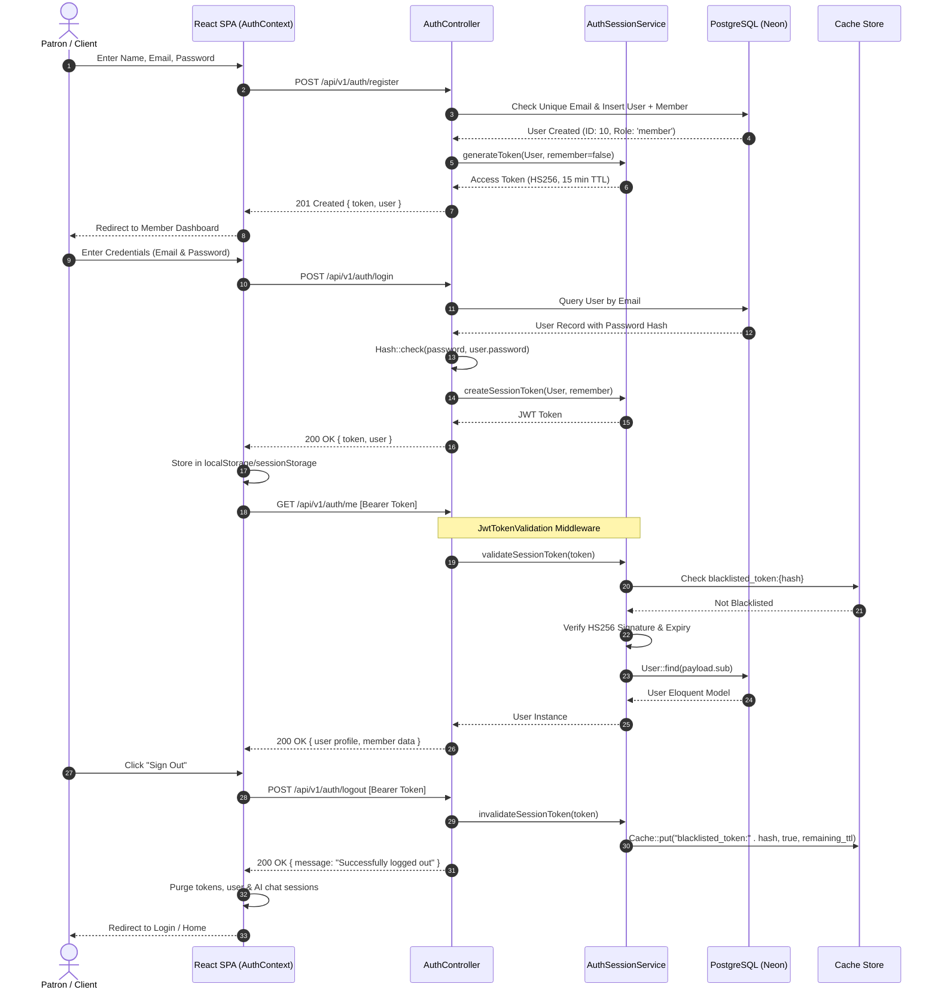

---

### 2.2. Physical Book Circulation: Checkout, Return & Overdue Fines
Illustrates the physical borrowing lifecycle, barcode verification, custom borrow limits, return handling, and overdue fine generation.

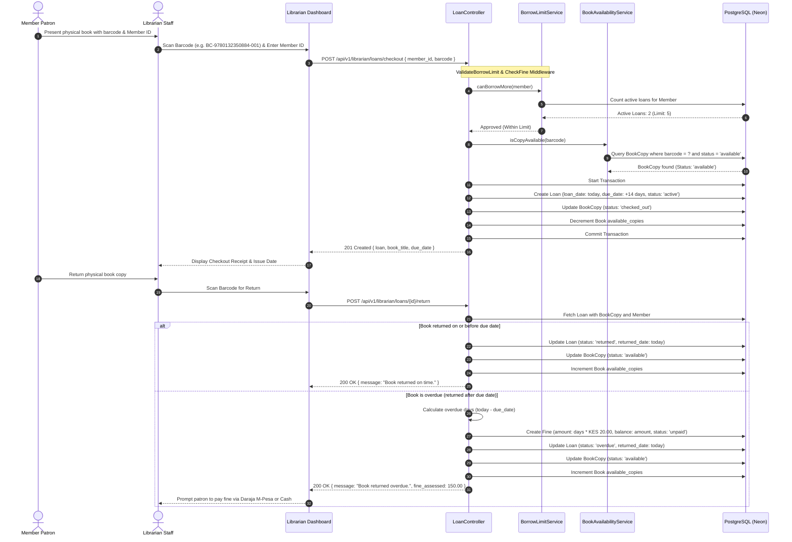

---

### 2.3. Hold Reservation Queue Lifecycle
Illustrates how patrons place holds when physical copies are exhausted, queue advancement, and staff fulfillment.

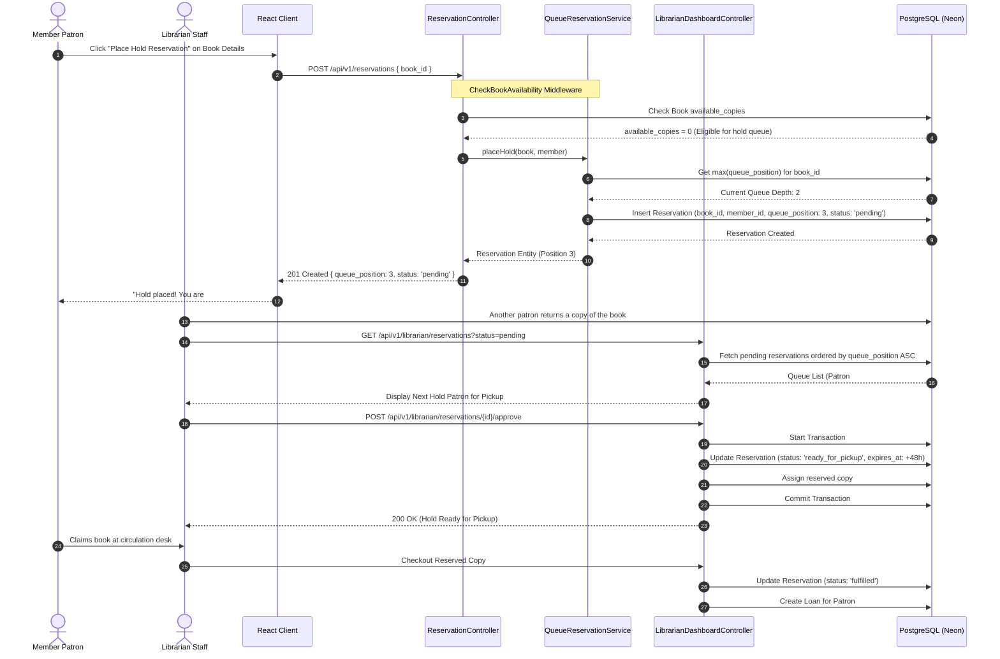

---

### 2.4. One-Time Digital Book Purchase via M-Pesa STK Push & Lifetime Access Reader
Illustrates cart checkout, Daraja STK Push prompt to mobile phone, automated callback webhook, lifetime access entitlement, and native reader streaming.

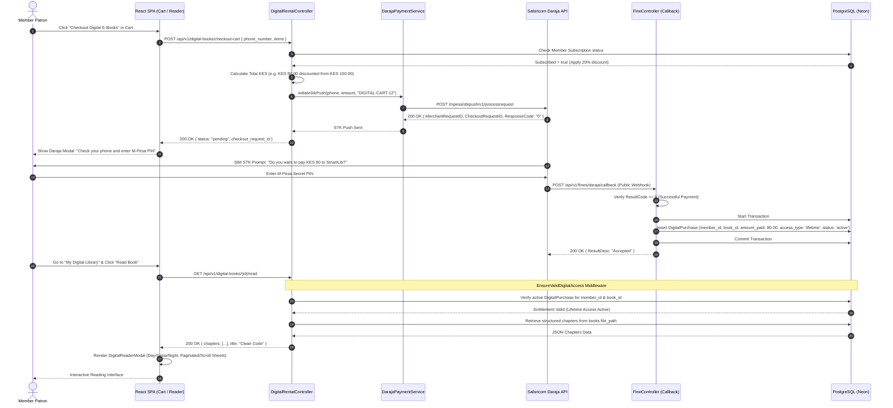

---

### 2.5. Membership Perk Pass Subscription & Refund Flow
Illustrates member tier upgrading, 20% discount perk activation, refund submission, and staff reimbursement approval.

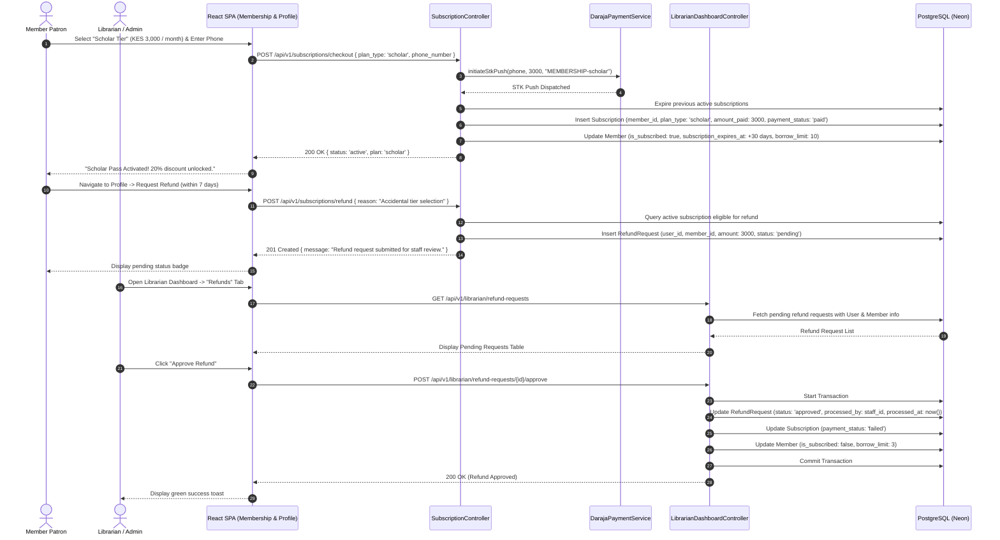

---

### 2.6. Smart AI Librarian Assistant: Rate-Limited RAG Query Flow
Illustrates contextual catalog retrieval, token bucket throttling, multi-provider execution (Gemini/OpenAI/Claude/Offline), and session persistence.

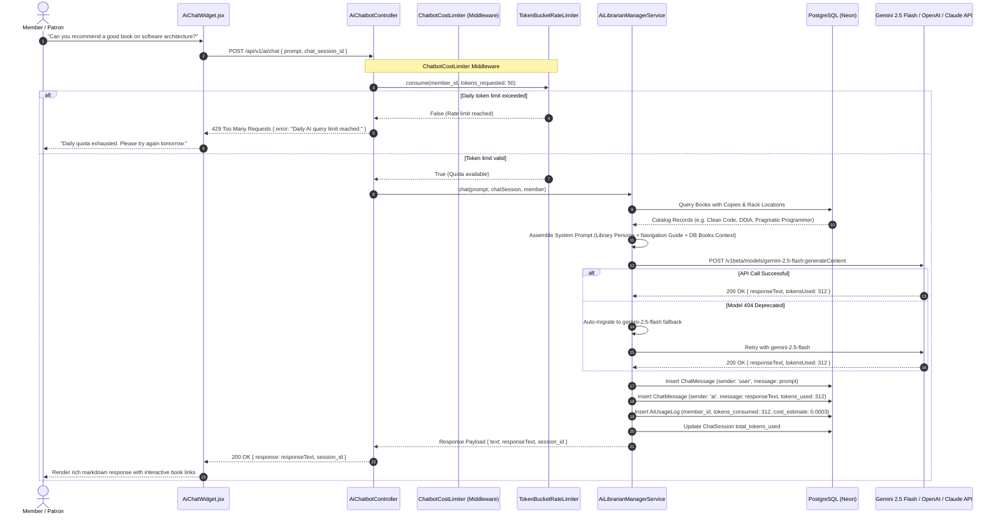

---

## 3. Class Diagrams

### 3.1. Eloquent Models Architecture
Contains all 14 data models, their attributes, column types, relationship accessors, mutators, and business logic methods.

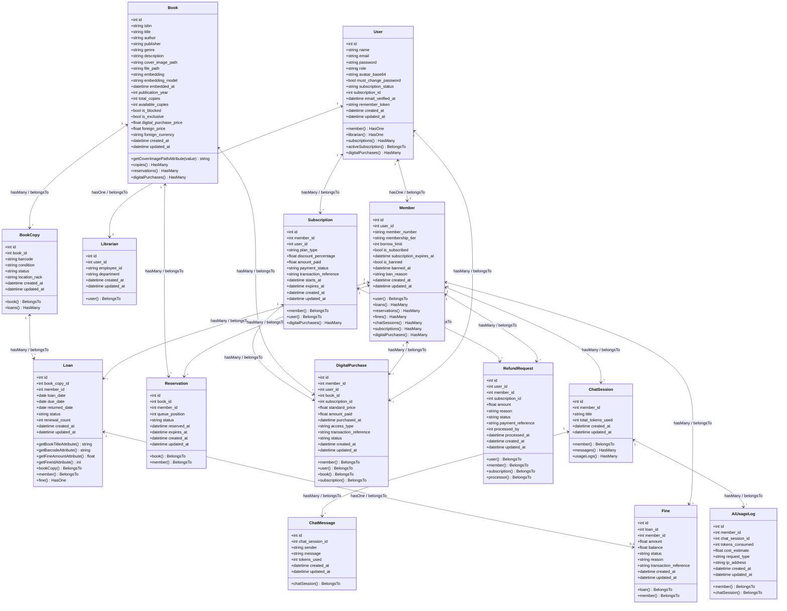

---

### 3.2. REST Controllers Layer
Contains controllers managing REST API endpoints, request validation, authorizations, and service delegation.

```mermaid
classDiagram
    class AuthController {
        -AuthSessionServiceInterface authService
        +register(Request request) JsonResponse
        +registerMembershipStk(Request request) JsonResponse
        +login(Request request) JsonResponse
        +me(Request request) JsonResponse
        +updateProfile(Request request) JsonResponse
        +refresh(Request request) JsonResponse
        +logout(Request request) JsonResponse
    }

    class BookInventoryController {
        -CatalogRetrievalServiceInterface catalogService
        -CurrencyConverterServiceInterface converter
        +index(Request request) JsonResponse
        +show(Book book) JsonResponse
        +store(Request request) JsonResponse
        +update(Request request, Book book) JsonResponse
        +destroy(Book book) JsonResponse
    }

    class CatalogSearchController {
        -CatalogSearchEngineInterface searchEngine
        +search(Request request) JsonResponse
    }

    class BookRecommendationController {
        -BookRecommendationServiceInterface recService
        +similar(Book book) JsonResponse
        +forMember(Request request) JsonResponse
    }

    class LoanController {
        -BookAvailabilityServiceInterface availService
        -BorrowLimitServiceInterface limitService
        -NotificationDispatcherServiceInterface notifyService
        +index(Request request) JsonResponse
        +checkout(Request request) JsonResponse
        +returnBook(Loan loan) JsonResponse
    }

    class FineController {
        -DarajaPaymentServiceInterface darajaService
        -NotificationDispatcherServiceInterface notifyService
        +index(Request request) JsonResponse
        +payWithDaraja(Fine fine, Request request) JsonResponse
        +darajaCallback(Request request) JsonResponse
        +waive(Fine fine) JsonResponse
    }

    class ReservationController {
        -QueueReservationServiceInterface queueService
        +index(Request request) JsonResponse
        +store(Request request) JsonResponse
        +destroy(Reservation reservation) JsonResponse
    }

    class DigitalRentalController {
        -DigitalRentalServiceInterface digitalService
        -DarajaPaymentServiceInterface darajaService
        +myLibrary(Request request) JsonResponse
        +checkoutCart(Request request) JsonResponse
        +purchase(int id, Request request) JsonResponse
        +read(int id, Request request) JsonResponse
    }

    class SubscriptionController {
        -DarajaPaymentServiceInterface darajaService
        -RefundManagementServiceInterface refundService
        +checkout(Request request) JsonResponse
        +status(Request request) JsonResponse
        +cancel(Request request) JsonResponse
        +requestRefund(Request request) JsonResponse
        +refundStatus(Request request) JsonResponse
    }

    class MembershipTierController {
        +index() JsonResponse
        +update(Request request) JsonResponse
        -getDefaultTiers() array
        -getSettingsFilePath() string
    }

    class AiChatbotController {
        -AiLibrarianManagerService aiManager
        +chat(Request request) JsonResponse
        +clearChat(Request request) JsonResponse
    }

    class AiSettingsController {
        -AiLibrarianManagerService aiManager
        +index() JsonResponse
        +update(Request request) JsonResponse
        +testKey(Request request) JsonResponse
        +fetchModels(Request request) JsonResponse
    }

    class LibrarianDashboardController {
        -OpenLibraryServiceInterface openLibrary
        +metrics() JsonResponse
        +members(Request request) JsonResponse
        +configureBorrowLimit(Member member, Request request) JsonResponse
        +toggleBookRestriction(Book book) JsonResponse
        +bookCopies(Request request) JsonResponse
        +storeBookCopy(Request request) JsonResponse
        +updateBookCopy(BookCopy copy, Request request) JsonResponse
        +deleteBookCopy(BookCopy copy) JsonResponse
        +activeLoans(Request request) JsonResponse
        +subscriptions(Request request) JsonResponse
        +storeSubscription(Request request) JsonResponse
        +updateSubscription(Subscription sub, Request request) JsonResponse
        +deleteSubscription(Subscription sub) JsonResponse
        +reimbursements() JsonResponse
        +reviewReimbursement(int id, Request request) JsonResponse
        +getRefundRequests() JsonResponse
        +approveRefund(int id) JsonResponse
        +rejectRefund(int id, Request request) JsonResponse
        +searchOpenLibrary(Request request) JsonResponse
        +importOpenLibrary(Request request) JsonResponse
        +reservations(Request request) JsonResponse
        +approveReservation(Reservation res) JsonResponse
        +denyReservation(Reservation res) JsonResponse
    }

    class AdminAnalyticsController {
        +analytics() JsonResponse
        +apiLogs(Request request) JsonResponse
        +banMember(Member member, Request request) JsonResponse
        +storeLibrarian(Request request) JsonResponse
    }

    class AdminCrudController {
        +indexTables() JsonResponse
        +getTableData(string table) JsonResponse
        +storeRecord(string table, Request request) JsonResponse
        +updateRecord(string table, int id, Request request) JsonResponse
        +destroyRecord(string table, int id) JsonResponse
    }
```

---

### 3.3. Services & Contracts Layer
Contains interfaces, domain business services, rate limiters, payment handlers, and external AI orchestrators.

```mermaid
classDiagram
    class AuthSessionServiceInterface {
        <<interface>>
        +createSessionToken(User user, bool remember) string
        +validateSessionToken(string token) ?User
        +invalidateSessionToken(string token) bool
        +getAuthenticatedUser(string token) ?User
    }

    class AuthSessionService {
        -string secret
        +generateToken(User user, bool remember) string
        +generateAccessToken(User user) string
        +generateRefreshToken(User user) string
        +buildJwt(User user, string type, int ttl) string
        +validateToken(string token) ?array
        +blacklistToken(string token) void
    }

    class DigitalRentalServiceInterface {
        <<interface>>
        +purchaseBook(Member member, Book book, string ref) DigitalPurchase
        +hasDigitalAccess(Member member, Book book) bool
        +getMemberLibrary(Member member) Collection
    }

    class DigitalRentalService {
        +purchaseBook(Member member, Book book, string ref) DigitalPurchase
        +hasDigitalAccess(Member member, Book book) bool
        +getMemberLibrary(Member member) Collection
        +canReadBook(Member member, Book book) bool
        +getPurchasedContent(Member member, Book book) string
    }

    class DarajaPaymentServiceInterface {
        <<interface>>
        +initiateStkPush(string phone, float amount, string ref) array
        +processCallback(array payload) array
        +queryStatus(string checkoutRequestId) array
    }

    class DarajaPaymentService {
        -string consumerKey
        -string consumerSecret
        -string passkey
        -string shortcode
        -string env
        +generateAccessToken() string
        +initiateStkPush(string phone, float amount, string ref) array
        +processCallback(array payload) array
        +queryStatus(string checkoutRequestId) array
    }

    class OpenLibraryServiceInterface {
        <<interface>>
        +search(string query, int page) array
        +importToCatalog(array bookData) Book
    }

    class OpenLibraryService {
        -string userAgent
        -int throttleMs
        +search(string query, int page) array
        +fetchSubject(string subject, int limit) array
        +importToCatalog(array bookData) Book
        +buildBookCopies(Book book, int count) void
    }

    class AiLibrarianManagerService {
        -string settingsFilePath
        +getDefaultSystemPrompt() string
        +getDefaultSettings() array
        +getSettings() array
        +saveSettings(array settings) void
        +testKey(string provider, string key) array
        +fetchAvailableModels(string provider, ?string key) array
        +chat(string prompt, ?ChatSession session, ?Member member) array
        -callGemini(string prompt, array config, string systemPrompt) array
        -callOpenAi(string prompt, array config, string systemPrompt) array
        -callAnthropic(string prompt, array config, string systemPrompt) array
        -callOfflineEngine(string prompt, ?Member member) array
        -buildCatalogContext() string
    }

    class TokenBucketRateLimiter {
        +consume(int memberId, int tokens) bool
        +getRemainingTokens(int memberId) int
        +reset(int memberId) void
    }

    class BookRecommendationService {
        +getSimilarBooks(Book book, int limit) Collection
        +getRecommendationsForMember(Member member, int limit) Collection
        -buildTfIdfMatrix(Collection books) array
        -computeCosineSimilarity(array vec1, array vec2) float
    }

    class CurrencyConverterService {
        -float fallbackRate
        +convertUsdToKes(float usdAmount) float
        +getExchangeRates() array
    }

    class BorrowLimitService {
        +canBorrowMore(Member member) bool
        +getActiveLoansCount(Member member) int
        +getEffectiveLimit(Member member) int
    }

    class QueueReservationService {
        +placeHold(Book book, Member member) Reservation
        +cancelReservation(Reservation reservation) bool
        +getNextInQueue(Book book) ?Reservation
        +fulfillReservation(Reservation reservation) Loan
    }

    AuthSessionServiceInterface <|.. AuthSessionService
    DigitalRentalServiceInterface <|.. DigitalRentalService
    DarajaPaymentServiceInterface <|.. DarajaPaymentService
    OpenLibraryServiceInterface <|.. OpenLibraryService
```

---

## 4. Complete Database Schema

### 4.1. Entity-Relationship (ER) Diagram

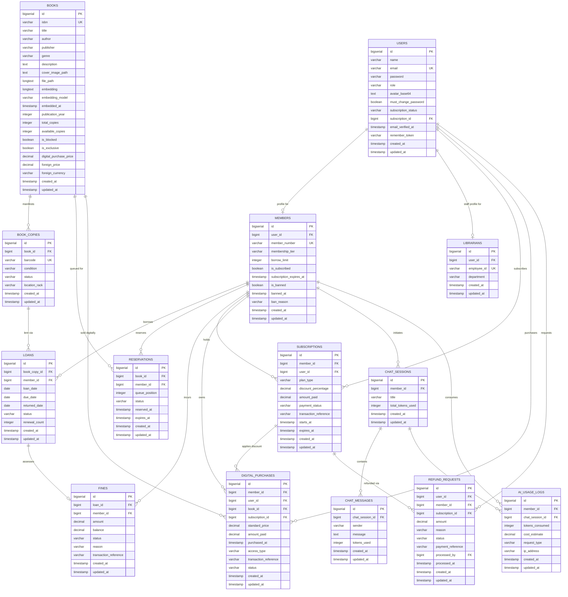

---

### 4.2. Database Schema Table Dictionary

#### 1. `users` Table
Primary authentication entity for patrons, librarians, and administrators.
| Column | Type | Nullable | Default | Description |
| :--- | :--- | :--- | :--- | :--- |
| `id` | `BIGSERIAL` | No | Auto | Primary key |
| `name` | `VARCHAR(255)` | No | — | Full name of user |
| `email` | `VARCHAR(255)` | No | — | Unique login email |
| `email_verified_at` | `TIMESTAMP` | Yes | `NULL` | Verification timestamp |
| `password` | `VARCHAR(255)` | No | — | Bcrypt / Argon2 password hash |
| `role` | `VARCHAR(255)` | No | `'member'` | Role gate: `member`, `librarian`, `admin` |
| `avatar_base64` | `TEXT` | Yes | `NULL` | Base64 encoded patron avatar image |
| `must_change_password` | `BOOLEAN` | No | `FALSE` | Enforced first-login password reset |
| `subscription_status` | `VARCHAR(255)`| No | `'none'` | `'none'`, `'active'`, `'expired'` |
| `subscription_id` | `BIGINT` | Yes | `NULL` | FK to `subscriptions.id` (current pass) |
| `remember_token` | `VARCHAR(100)` | Yes | `NULL` | Session cookie token |
| `created_at` | `TIMESTAMP` | Yes | `NULL` | Record creation timestamp |
| `updated_at` | `TIMESTAMP` | Yes | `NULL` | Record last updated timestamp |

#### 2. `members` Table
Patron-specific library profile and circulation parameters.
| Column | Type | Nullable | Default | Description |
| :--- | :--- | :--- | :--- | :--- |
| `id` | `BIGSERIAL` | No | Auto | Primary key |
| `user_id` | `BIGINT` | No | — | FK &rarr; `users.id` (ON DELETE CASCADE) |
| `member_number` | `VARCHAR(255)` | No | — | Unique identifier (e.g. `MEM-2026`) |
| `membership_tier` | `VARCHAR(255)` | No | `'standard'` | `student`, `standard`, `scholar`, `faculty`, `general` |
| `borrow_limit` | `INTEGER` | No | `3` | Maximum concurrent physical loans allowed |
| `is_subscribed` | `BOOLEAN` | No | `FALSE` | Active perk pass discount status |
| `subscription_expires_at` | `TIMESTAMP`| Yes | `NULL` | Perk pass expiry date |
| `is_banned` | `BOOLEAN` | No | `FALSE` | True if account access is restricted |
| `banned_at` | `TIMESTAMP` | Yes | `NULL` | Time ban was imposed |
| `ban_reason` | `VARCHAR(255)` | Yes | `NULL` | Administrative reason for ban |
| `created_at` | `TIMESTAMP` | Yes | `NULL` | Record created timestamp |
| `updated_at` | `TIMESTAMP` | Yes | `NULL` | Record updated timestamp |

#### 3. `librarians` Table
Staff-specific profile linking users to library circulation and catalog roles.
| Column | Type | Nullable | Default | Description |
| :--- | :--- | :--- | :--- | :--- |
| `id` | `BIGSERIAL` | No | Auto | Primary key |
| `user_id` | `BIGINT` | No | — | FK &rarr; `users.id` (ON DELETE CASCADE) |
| `employee_id` | `VARCHAR(255)` | No | — | Unique staff ID (e.g. `LIB-1002`) |
| `department` | `VARCHAR(255)` | Yes | `NULL` | Assigned library department |
| `created_at` | `TIMESTAMP` | Yes | `NULL` | Record created timestamp |
| `updated_at` | `TIMESTAMP` | Yes | `NULL` | Record updated timestamp |

#### 4. `books` Table
Core catalog metadata, digital reading contents, and retail pricing.
| Column | Type | Nullable | Default | Description |
| :--- | :--- | :--- | :--- | :--- |
| `id` | `BIGSERIAL` | No | Auto | Primary key |
| `isbn` | `VARCHAR(255)` | No | — | Unique standard book number |
| `title` | `VARCHAR(255)` | No | — | Official title |
| `author` | `VARCHAR(255)` | No | — | Author / contributors |
| `publisher` | `VARCHAR(255)` | Yes | `NULL` | Publishing house |
| `genre` | `VARCHAR(255)` | No | — | Literary category |
| `description` | `TEXT` | Yes | `NULL` | Book overview & synopsis |
| `cover_image_path`| `TEXT` | Yes | `NULL` | URL or asset path to book cover image |
| `file_path` | `LONGTEXT` | Yes | `NULL` | JSON multi-chapter structured content / PDF |
| `embedding` | `LONGTEXT` | Yes | `NULL` | JSON vector for semantic similarity |
| `embedding_model`| `VARCHAR(255)` | Yes | `NULL` | Model used for embedding generation |
| `embedded_at` | `TIMESTAMP` | Yes | `NULL` | Timestamp of last vector indexing |
| `publication_year`| `INTEGER` | Yes | `NULL` | Year of publication |
| `total_copies` | `INTEGER` | No | `1` | Total inventory copies owned |
| `available_copies`| `INTEGER` | No | `1` | Inventory copies currently on shelf |
| `is_blocked` | `BOOLEAN` | No | `FALSE` | If true, borrowing is restricted |
| `is_exclusive` | `BOOLEAN` | No | `FALSE` | VIP/Subscriber exclusive access |
| `digital_purchase_price` | `DECIMAL(8,2)` | No | `50.00` | Authoritative digital price in KES |
| `foreign_price` | `DECIMAL(10,2)`| Yes | `NULL` | Retail price in foreign currency |
| `foreign_currency` | `VARCHAR(3)` | Yes | `NULL` | Currency code (e.g. `USD`, `EUR`) |
| `created_at` | `TIMESTAMP` | Yes | `NULL` | Record created timestamp |
| `updated_at` | `TIMESTAMP` | Yes | `NULL` | Record updated timestamp |

#### 5. `book_copies` Table
Individual physical inventory units with unique scannable barcodes.
| Column | Type | Nullable | Default | Description |
| :--- | :--- | :--- | :--- | :--- |
| `id` | `BIGSERIAL` | No | Auto | Primary key |
| `book_id` | `BIGINT` | No | — | FK &rarr; `books.id` (ON DELETE CASCADE) |
| `barcode` | `VARCHAR(255)` | No | — | Unique barcode (e.g. `BC-9780132350884-001`) |
| `condition` | `VARCHAR(255)` | No | `'good'` | `'good'`, `'damaged'`, `'lost'` |
| `status` | `VARCHAR(255)` | No | `'available'` | `'available'`, `'checked_out'`, `'reserved'`, `'maintenance'` |
| `location_rack` | `VARCHAR(255)` | Yes | `NULL` | Physical shelf location (e.g. `Rack-3`) |
| `created_at` | `TIMESTAMP` | Yes | `NULL` | Record created timestamp |
| `updated_at` | `TIMESTAMP` | Yes | `NULL` | Record updated timestamp |

#### 6. `loans` Table
Physical borrowing transactions.
| Column | Type | Nullable | Default | Description |
| :--- | :--- | :--- | :--- | :--- |
| `id` | `BIGSERIAL` | No | Auto | Primary key |
| `book_copy_id` | `BIGINT` | No | — | FK &rarr; `book_copies.id` (ON DELETE CASCADE) |
| `member_id` | `BIGINT` | No | — | FK &rarr; `members.id` (ON DELETE CASCADE) |
| `loan_date` | `DATE` | No | — | Date book was checked out |
| `due_date` | `DATE` | No | — | Date book must be returned |
| `returned_date` | `DATE` | Yes | `NULL` | Date book was checked back in |
| `status` | `VARCHAR(255)` | No | `'active'` | `'active'`, `'returned'`, `'overdue'` |
| `renewal_count` | `INTEGER` | No | `0` | Number of times loan was extended |
| `created_at` | `TIMESTAMP` | Yes | `NULL` | Record created timestamp |
| `updated_at` | `TIMESTAMP` | Yes | `NULL` | Record updated timestamp |

#### 7. `reservations` Table
Hold reservation queue for books with zero available physical copies.
| Column | Type | Nullable | Default | Description |
| :--- | :--- | :--- | :--- | :--- |
| `id` | `BIGSERIAL` | No | Auto | Primary key |
| `book_id` | `BIGINT` | No | — | FK &rarr; `books.id` (ON DELETE CASCADE) |
| `member_id` | `BIGINT` | No | — | FK &rarr; `members.id` (ON DELETE CASCADE) |
| `queue_position`| `INTEGER` | No | `1` | FIFO queue position |
| `status` | `VARCHAR(255)` | No | `'pending'` | `'pending'`, `'ready_for_pickup'`, `'fulfilled'`, `'expired'`, `'cancelled'` |
| `reserved_at` | `TIMESTAMP` | No | `CURRENT_TIMESTAMP` | Time hold was placed |
| `expires_at` | `TIMESTAMP` | Yes | `NULL` | 48h pickup window expiration |
| `created_at` | `TIMESTAMP` | Yes | `NULL` | Record created timestamp |
| `updated_at` | `TIMESTAMP` | Yes | `NULL` | Record updated timestamp |

#### 8. `fines` Table
Overdue fines assessed on late returns and damages.
| Column | Type | Nullable | Default | Description |
| :--- | :--- | :--- | :--- | :--- |
| `id` | `BIGSERIAL` | No | Auto | Primary key |
| `loan_id` | `BIGINT` | No | — | FK &rarr; `loans.id` (ON DELETE CASCADE) |
| `member_id` | `BIGINT` | No | — | FK &rarr; `members.id` (ON DELETE CASCADE) |
| `amount` | `DECIMAL(10,2)`| No | — | Total fine assessed in KES |
| `balance` | `DECIMAL(10,2)`| No | — | Remaining unpaid balance |
| `status` | `VARCHAR(255)` | No | `'unpaid'` | `'unpaid'`, `'paid'`, `'waived'`, `'partial'` |
| `reason` | `VARCHAR(255)` | No | `'overdue'` | `'overdue'`, `'damage'`, `'loss'` |
| `transaction_reference` | `VARCHAR(255)`| Yes | `NULL` | Daraja M-Pesa receipt code |
| `created_at` | `TIMESTAMP` | Yes | `NULL` | Record created timestamp |
| `updated_at` | `TIMESTAMP` | Yes | `NULL` | Record updated timestamp |

#### 9. `subscriptions` Table
Member perk subscription passes granting digital discounts and higher borrow limits.
| Column | Type | Nullable | Default | Description |
| :--- | :--- | :--- | :--- | :--- |
| `id` | `BIGSERIAL` | No | Auto | Primary key |
| `member_id` | `BIGINT` | No | — | FK &rarr; `members.id` (ON DELETE CASCADE) |
| `user_id` | `BIGINT` | No | — | FK &rarr; `users.id` (ON DELETE CASCADE) |
| `plan_type` | `VARCHAR(255)` | No | `'pro_perks_monthly'` | Tier plan code (e.g. `scholar`, `student`) |
| `discount_percentage` | `DECIMAL(5,2)`| No | `20.00` | Percentage discount on digital purchases |
| `amount_paid` | `DECIMAL(10,2)`| No | `500.00` | Fee paid in KES |
| `payment_status`| `VARCHAR(255)` | No | `'paid'` | `'pending'`, `'paid'`, `'failed'` |
| `transaction_reference` | `VARCHAR(255)`| Yes | `NULL` | Daraja STK checkout reference |
| `starts_at` | `TIMESTAMP` | No | `CURRENT_TIMESTAMP` | Subscription start timestamp |
| `expires_at` | `TIMESTAMP` | Yes | `NULL` | Subscription expiry timestamp |
| `created_at` | `TIMESTAMP` | Yes | `NULL` | Record created timestamp |
| `updated_at` | `TIMESTAMP` | Yes | `NULL` | Record updated timestamp |

#### 10. `digital_purchases` Table
Permanent, one-time paid entitlements granting lifetime digital reader access.
| Column | Type | Nullable | Default | Description |
| :--- | :--- | :--- | :--- | :--- |
| `id` | `BIGSERIAL` | No | Auto | Primary key |
| `member_id` | `BIGINT` | No | — | FK &rarr; `members.id` (ON DELETE CASCADE) |
| `user_id` | `BIGINT` | No | — | FK &rarr; `users.id` (ON DELETE CASCADE) |
| `book_id` | `BIGINT` | No | — | FK &rarr; `books.id` (ON DELETE CASCADE) |
| `subscription_id`| `BIGINT` | Yes | `NULL` | FK &rarr; `subscriptions.id` (discount applied) |
| `standard_price`| `DECIMAL(8,2)` | No | — | Standard retail catalog price |
| `amount_paid` | `DECIMAL(8,2)` | No | — | Final price paid after member perks |
| `purchased_at` | `TIMESTAMP` | No | `CURRENT_TIMESTAMP` | Purchase completion timestamp |
| `access_type` | `VARCHAR(255)` | No | `'lifetime'` | Indefinite lifetime reading license |
| `transaction_reference` | `VARCHAR(255)`| Yes | `NULL` | Daraja payment reference |
| `status` | `VARCHAR(255)` | No | `'active'` | `'active'`, `'refunded'` |
| `created_at` | `TIMESTAMP` | Yes | `NULL` | Record created timestamp |
| `updated_at` | `TIMESTAMP` | Yes | `NULL` | Record updated timestamp |

#### 11. `refund_requests` Table
Member refund requests for perk subscriptions with staff audit trail.
| Column | Type | Nullable | Default | Description |
| :--- | :--- | :--- | :--- | :--- |
| `id` | `BIGSERIAL` | No | Auto | Primary key |
| `user_id` | `BIGINT` | No | — | FK &rarr; `users.id` (ON DELETE CASCADE) |
| `member_id` | `BIGINT` | No | — | FK &rarr; `members.id` (ON DELETE CASCADE) |
| `subscription_id`| `BIGINT` | Yes | `NULL` | FK &rarr; `subscriptions.id` |
| `amount` | `DECIMAL(10,2)`| No | — | Requested refund amount |
| `reason` | `VARCHAR(255)` | No | — | Reason provided by patron |
| `status` | `VARCHAR(255)` | No | `'pending'` | `'pending'`, `'approved'`, `'rejected'` |
| `payment_reference`| `VARCHAR(255)`| Yes | `NULL` | Original transaction reference |
| `processed_by` | `BIGINT` | Yes | `NULL` | FK &rarr; `users.id` (Staff who reviewed) |
| `processed_at` | `TIMESTAMP` | Yes | `NULL` | Timestamp of staff review |
| `created_at` | `TIMESTAMP` | Yes | `NULL` | Record created timestamp |
| `updated_at` | `TIMESTAMP` | Yes | `NULL` | Record updated timestamp |

#### 12. `chat_sessions`, `chat_messages`, `ai_usage_logs` Tables
Context-aware AI Librarian conversation sessions and cost audit logs.
| Table | Key Columns | Description |
| :--- | :--- | :--- |
| **`chat_sessions`** | `id`, `member_id` (FK), `title`, `total_tokens_used`, `timestamps` | Chat container per patron session. |
| **`chat_messages`** | `id`, `chat_session_id` (FK), `sender` (`user`/`ai`), `message`, `tokens_used`, `timestamps` | Conversation turn messages. |
| **`ai_usage_logs`** | `id`, `member_id` (FK), `chat_session_id` (FK), `tokens_consumed`, `cost_estimate`, `request_type`, `ip_address`, `timestamps` | Cost and token consumption ledger. |

