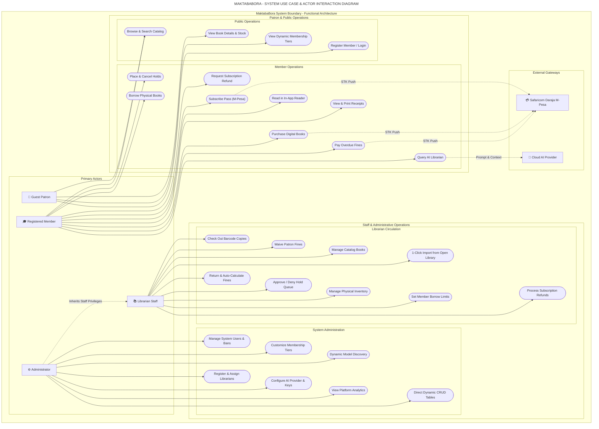

# MaktabaBora - Use Case Diagram Specification

This document details the functional use cases, system boundary, and actor interactions for the **MaktabaBora Library Management System**, optimized for **Horizontal A4** presentation and architectural reviews.

---

## 1. System Actors

| Actor | Category | Description |
| :--- | :--- | :--- |
| **Guest / Public Patron** | Human / External | Unregistered visitor browsing public catalog, inspecting book synopses, and viewing membership options. |
| **Registered Member** | Human / Authenticated | Student, Scholar, or General patron borrowing physical books, placing holds, buying digital books, and querying AI. |
| **Librarian Staff** | Human / Staff | Front desk and inventory staff managing barcodes, checking out loans, waiving fines, approving holds, and importing catalog books. |
| **System Administrator** | Human / Governance | Library director managing users, librarians, membership tiers, AI provider settings, dynamic models, and platform logs. |
| **Safaricom Daraja API** | External Gateway | Mobile money gateway handling STK push prompts for fines, membership passes, and digital e-book purchases. |
| **Cloud AI Provider** | External Gateway | AI inference gateway (Google Gemini, OpenAI, Anthropic Claude) supplying catalog-grounded responses. |

---

## 2. Horizontal A4 Use Case Diagram

---

## 3. Functional Use Cases Matrix

| ID | Use Case Name | Primary Actor | Description |
| :--- | :--- | :--- | :--- |
| **UC1** | Browse & Search Catalog | Guest / Member | Search catalog by title, author, genre, or keyword with real-time availability counters. |
| **UC2** | View Book Details & Stock | Guest / Member | Inspect book synopsis, publication details, shelf location, and physical copy statuses. |
| **UC3** | View Dynamic Membership Tiers | Guest / Member | View active membership tiers, borrowing limits, discount percentages, and monthly fees. |
| **UC4** | Register / Login | Guest | Create new member account or authenticate to obtain JWT session token. |
| **UC5** | Borrow Physical Books | Member | Borrow shelf copies, inspect active loan periods, and monitor due dates. |
| **UC6** | Place & Cancel Holds | Member | Place hold reservations on unavailable books and track queue position. |
| **UC7** | Subscribe Pass (M-Pesa) | Member | Purchase or upgrade membership tier via automated Safaricom Daraja STK push. |
| **UC8** | Request Subscription Refund | Member | Submit refund requests for accidental subscriptions within statutory window. |
| **UC9** | Purchase Digital Books | Member | Purchase lifetime access to e-books via integrated Daraja STK push. |
| **UC10** | Read in In-App Reader | Member | Read purchased e-books in distraction-free chapter reader with flip/scroll modes. |
| **UC11** | Pay Overdue Fines | Member | Settle overdue circulation fines instantly via M-Pesa STK push. |
| **UC12** | View & Print Receipts | Member | Access official verifiable receipts for purchases and reservation slips. |
| **UC13** | Query AI Librarian | Member | Ask natural language questions with rate-limited RAG catalog recommendations. |
| **UC14** | Check Out Barcode Copies | Librarian | Scan physical book barcode (`BC-...`) and issue loan to validated member. |
| **UC15** | Return & Auto-Calculate Fines | Librarian | Scan returned copy; system automatically assesses fines if returned past due date. |
| **UC16** | Waive Patron Fines | Librarian | Waive or adjust accrued overdue fines for patrons under special circumstances. |
| **UC17** | Approve / Deny Hold Queue | Librarian | Process pending hold reservations and assign available copies to next in line. |
| **UC18** | Manage Catalog Books | Librarian | Create, update, or block catalog titles, prices, and classifications. |
| **UC19** | Manage Physical Inventory | Librarian | Add physical copies, assign barcode serials, and designate shelf rack locations. |
| **UC20** | 1-Click Import from Open Library | Librarian | Search Open Library and import books with covers, metadata, and auto-copies. |
| **UC21** | Set Member Borrow Limits | Librarian | Override standard tier borrowing limits for trusted or VIP patrons. |
| **UC22** | Process Subscription Refunds | Librarian | Review member refund claims and approve/reject reimbursement disbursements. |
| **UC23** | Manage System Users & Bans | Administrator | Oversee registered accounts, reset credentials, and ban/unban members. |
| **UC24** | Register & Assign Librarians | Administrator | Provision librarian staff credentials and assign departmental roles. |
| **UC25** | Customize Membership Tiers | Administrator | Modify tier pricing, borrow quotas, perks, and discount rates. |
| **UC26** | Configure AI Provider & Keys | Administrator | Configure Gemini, OpenAI, Claude, or Offline engine with system prompts and keys. |
| **UC27** | Dynamic Model Discovery | Administrator | Query live provider APIs to discover and switch to newly released LLM models. |
| **UC28** | View Platform Analytics | Administrator | Inspect system metrics, loan circulation trends, revenue, and API usage. |
| **UC29** | Direct Dynamic CRUD Tables | Administrator | Directly inspect and manage underlying relational tables with audit validation. |
