# Use Case Diagram Specification

This document details the functional use cases and actor interactions for the **Smart Library Management System (SmartLib / MaktabaBora)**.

---

## 1. Actors

| Actor | Category | Description |
| :--- | :--- | :--- |
| **Guest / Public Patron** | Human / External | Unregistered visitor browsing public catalog, inspecting book synopses, and viewing membership options. |
| **Registered Member** | Human / Authenticated | Student, Scholar, or General patron borrowing physical books, placing holds, buying digital books, and querying AI. |
| **Librarian Staff** | Human / Staff | Front desk and inventory staff managing barcodes, checking out loans, waiving fines, approving holds, and importing catalog books. |
| **System Administrator** | Human / Governance | Library director managing users, librarians, membership tiers, AI provider settings, dynamic models, and logs. |
| **Safaricom Daraja API** | External Gateway | Mobile money gateway handling STK push prompts for fines, membership passes, and digital e-book purchases. |
| **Cloud AI Provider** | External Gateway | AI inference gateway (Google Gemini, OpenAI, Anthropic Claude) supplying catalog-grounded responses. |

---

## 2. Use Case Diagram

```mermaid
flowchart TD
    %% Actors
    Guest["👤 Guest / Public Patron"]
    Member["🎓 Registered Member"]
    Librarian["📚 Librarian Staff"]
    Admin["⚙️ System Administrator"]
    Daraja["💳 Safaricom Daraja M-Pesa Gateway"]
    AiProvider["🤖 AI Provider (Gemini / OpenAI / Claude)"]

    %% Guest Use Cases
    subgraph Guest_Use_Cases ["Public & Guest Operations"]
        UC1(["Browse & Search OPAC Catalog"])
        UC2(["View Book Synopsis & Shelf Availability"])
        UC3(["View Dynamic Membership Tiers"])
        UC4(["Register Member Account / Login"])
    end

    %% Member Use Cases
    subgraph Member_Use_Cases ["Member Operations"]
        UC5(["Borrow Physical Books (View Active Loans & Due Dates)"])
        UC6(["Place & Cancel Hold Reservations"])
        UC7(["Subscribe / Upgrade Membership Pass (M-Pesa STK)"])
        UC8(["Request Subscription Refund & Check Status"])
        UC9(["Purchase Digital Books with Lifetime Access"])
        UC10(["Read E-Books in Native Chapter Reader / PDF Stream"])
        UC11(["Pay Overdue Fines via M-Pesa STK Push"])
        UC12(["View & Print Purchase / Reservation Receipts"])
        UC13(["Query Smart AI Librarian Assistant"])
    end

    %% Librarian Use Cases
    subgraph Librarian_Use_Cases ["Librarian Circulation & Catalog Operations"]
        UC14(["Check Out Physical Book Copy (Barcode BC-...)"])
        UC15(["Process Return & Auto-Calculate Overdue Fines"])
        UC16(["Waive Patron Fines"])
        UC17(["Approve / Deny Hold Reservations & Queue"])
        UC18(["Manage Catalog (Add, Edit, Block Books)"])
        UC19(["Manage Physical Copies (Racks, Barcodes, Maintenance)"])
        UC20(["Search & 1-Click Import from Open Library"])
        UC21(["Configure Member Custom Borrow Limits"])
        UC22(["Review & Process Subscription Refund Requests"])
    end

    %% Administrator Use Cases
    subgraph Admin_Use_Cases ["Administrator & Governance Operations"]
        UC23(["Manage System Users & Ban/Unban Members"])
        UC24(["Register & Assign Librarians"])
        UC25(["Customize Membership Tiers (Limits, Prices, Perks)"])
        UC26(["Configure AI Providers, Models & System Guidelines"])
        UC27(["Dynamic Model Discovery (Live API Fetch)"])
        UC28(["View Platform Analytics, Revenue & API Traffic Logs"])
        UC29(["Direct Dynamic Table CRUD Management"])
    end

    %% Guest Associations
    Guest --> UC1
    Guest --> UC2
    Guest --> UC3
    Guest --> UC4

    %% Member Associations
    Member --> UC1
    Member --> UC5
    Member --> UC6
    Member --> UC7
    Member --> UC8
    Member --> UC9
    Member --> UC10
    Member --> UC11
    Member --> UC12
    Member --> UC13

    %% Librarian Associations
    Librarian --> UC14
    Librarian --> UC15
    Librarian --> UC16
    Librarian --> UC17
    Librarian --> UC18
    Librarian --> UC19
    Librarian --> UC20
    Librarian --> UC21
    Librarian --> UC22

    %% Admin Associations
    Admin --> UC23
    Admin --> UC24
    Admin --> UC25
    Admin --> UC26
    Admin --> UC27
    Admin --> UC28
    Admin --> UC29
    Admin -.->|Inherits Permissions| Librarian

    %% External Systems
    UC7 -.->|STK Push| Daraja
    UC9 -.->|STK Push| Daraja
    UC11 -.->|STK Push| Daraja
    UC13 -.->|Prompt & Context| AiProvider
```

